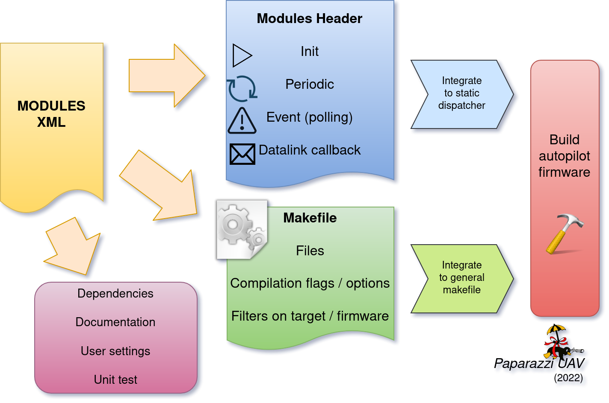

.. developer_guide modules

========
Modules
========

Modules use code generation in order to allow people to use them by only editing the vehicle's XML configuration
as opposed to changing/adding to the code of the autopilot. This makes the paparazzi build process highly configurable.
Typically, function calls are generated for initialization and in the main loop for timers
(``periodic`` in Paparazzi slang) and events. The event and periodic functions of the Modules get called at the end of
``event_task_ap`` and ``periodic_task_ap respectively``.

Modules are used to configure all parts of Paparazzi other than the ``firmware`` sections.
The build configuration for each module is described using XML description language and the located in the
``conf/modules`` subfolder. These modules implement not only the user implemented mission specific code but also the
low level drivers and subsystems.

``sw/airborne/modules`` contains the mission specific software such as image processing, video recording or relay or
guidance commands.

Using existing modules
--------------------------
To add a module to an aircraft, add a section modules in his airframe XML file :

Arbitrary airframe file: conf/airframes/myplane.xml

.. code-block:: xml

 <firmware name="fixedwing">

    <module name="my_module">
       <define name="BLA" value="1"/>
       <define name="BLUB"/>
       <configure name="FOO" value="BAR"/>
    </module>

  </firmware>

All modules must be included within firmware sections. The firmware implements some vehicle specific code using
predefined Makefiles. The most common ``firmware`` types are ``rotorcraft`` and ``fixedwing``, but more exist and are
all located in the ``conf/firmware`` folder.

A module will consist of a ``module`` node that specifies the name of the module that should be included (in this case
``name="my_module"``).
The children ``define`` and ``configure`` are optional and module specific. They can be used to specify the value of
certain variables used in the module. A ``define`` will generate compilation defines for all the targets of a module
and can be used with or without an associated value. For more information on ``define`` and ``configure`` have a look at
the section :ref:`Airframe Defines and GCS Settings <label-defines-and-settings>`.

Make Your Own
---------------
It is very possible to make your own module and to share it with the world. To make it even easier there is a helper tool
called ``create_mod_qt.py`` that can be found in ``sw/tools/create_module/``. To run it you will need Python 3 and a
few Python packages that can be installed by running in your terminal:

.. code-block:: bash

    cd paparazzi/sw/tools/create_module
    python3 -m pip install -r requirements.txt
    python3 create_mod_qt.py

This program can also be launched directly from the Paparazzi Center, by selecting ``Tools -> Module Creator`` from the
Menu bar.
Try it, you'll be surprised how easy it is to start your own module with the help of this tool.

Another way to go about creating your module is by copying another module's files and editing the relevant parts.
In order to do this, it is necessary to understand a bit more about how modules work in Paparazzi, starting with where
all the files of a module are located.

Module Files Location
-----------------------
Modules consist of the following files: a module XML file, source and header files.

.. code-block:: text

    ├── conf
    │   ├── airframes
    │   ├── autopilot
    │   ├── flight_plans
    │   ├── modules   <---- Contains module XML with description, defines, compilation instructions
    │   ├── radios
    │   ...
    ├── doc
    ├── sw
    │   ├── airborne
    │   │   └── modules   <---- Contains module source and header files
    │   ├── ext
    │   ...
    ...

.. _label-module-xml:

Module XML
--------------
The module description files are located in ``conf/modules/``. They contain information such as a description of the module,
module settings that can be controlled from the GCS, which source files are needed to compile the module, and additional
module specific compiler flags.

Here is an example of a module XML file. Not all of the XML nodes that are shown are actually required, as will be explained
in this section.

.. code-block:: xml

    <!DOCTYPE module SYSTEM "module.dtd">
    <module name="demo_module">

      <doc>
        <description>
          Demo module
        </description>
        <configure name="SOMETHING" value="S1|S2|S3" description="The thing to use"/>
        <define name="DEMO_MODULE_LED" value="LED_X" description="LED Selection"/>
      </doc>

      <settings>
        <dl_settings name="bla">
          <dl_setting min="0" max="5" step="1" var="bla_bla" shortname="bb"/>
        </dl_settings>
      <settings>

      <dep>
        <depends>module1,module2|module3,@functionality1</depends>
        <provides>functionality2</provides>
        <conflicts>module4,@functionality3</conflicts>
      </dep>

      <header>
        <file name="demo_module.h"/>
      </header>

      <init fun="init_demo()"/>

      <periodic fun="periodic_1Hz_demo()" freq="1." start="start_demo()" stop="stop_demo()" autorun="TRUE"/>
      <periodic fun="periodic_10Hz_demo()" period="0.1" start="start_demo()" stop="stop_demo()" autorun="FALSE"/>

      <makefile>
        <raw>
          #Example of RAW makefile part
        </raw>
        <define name="DEMO_MODULE_LED" value="2"/>
        <file name="demo_module.c"/>
      </makefile>

      <makefile target="demo">
        <define name="SOME_FLAG"/>
        <configure name="SOME_DEFINE" value="bla"/>
      </makefile>

    </module>

The XML file starts with a ``module`` element that sets the name of the module (in this case ``demo_module``).
Optionally, this element can contain a ``dir`` attribute as well, to specify the location of the source files relative to
``sw/airborne/modules/``.
In this case the directory is not provided since the source files are located in a directory inside ``sw/airborne/modules/``
that has the same name as the module name (``sw/airborne/modules/demo_module/``).

After a documentation and dependency section, the XML contains a `header` element, where the header files of the
module are listed.
Typically, you will only see one header file here that provides an easy-to-use access point for other modules.

The header element is often followed by an ``init`` and ``periodic`` element.
These specify what functions in your module code should be called by the autopilot, and in case of the periodic function
it also specifies its frequency in Hz. The other two function types that can be specified consist of ``event`` and
``datalink`` functions.

At the end of the XML file is the `makefile` element. This section describes how your source files should be compiled.
Simple modules such as the demo_module only list one or more source files. More complicated modules such as
``cv_opencvdemo`` can specify additional compiler flags (to link OpenCV, for example) and can have different
makefile sections depending on whether the autopilot is compiled for use on the drone (``target="ap"``) or in
simulation (``target="nps"``).

The source and header files of your module can be found in ``sw/airborne/modules/<your_module_dir>/``.
We take a closer look at the content of these files in the :ref:`Header <label-module-header-file>` and
:ref:`Source <label-module-source-file>` Sections.

Here is an overview of all possible Module XML nodes:

+---------------+---------------+-------------------------------------------------------------------------+
|      Node     |   Children    |                               Description                               |
+===============+===============+=========================================================================+
|               | name          | This parameter is the name of the module (mandatory)                    |
|               | (required)    |                                                                         |
| | module      +---------------+-------------------------------------------------------------------------+
| | (required)  |               | The name of the directory in ``sw/airborne/modules`` where the source   |
|               | dir           | code is located. If not specified, the name of the module is used as    |
|               |               | default directory name                                                  |
+---------------+---------------+-------------------------------------------------------------------------+
|               | description   | A description of the module. The content of the first line until        |
|               | (required)    | the dot is treated as the brief description used as the name in         |
|               |               | the generated docs                                                      |
|               +---------------+-------------------------------------------------------------------------+
|               | define        | Describe the possible define flags for this module with default         |
|               |               | values and a short description (usually called from the airframe        |
| | doc         |               | firmware section                                                        |
| | (optional)  +---------------+-------------------------------------------------------------------------+
|               | configure     | Describe the possible configuration options for this module with        |
|               |               | default values and a short description (usually called from the         |
|               |               | airframe firmware section                                               |
|               +---------------+-------------------------------------------------------------------------+
|               | section       | Describe the parameters that can be added as a section in the           |
|               |               | airframe configuration file                                             |
+---------------+---------------+-------------------------------------------------------------------------+
|               | target        | A list of targets allowed or forbidden for which embedded settings      |
|               |               | should be used                                                          |
| | settings    +---------------+-------------------------------------------------------------------------+
| | (0 or more) | dl_settings   | Creates a tab with arbitrary name that can be specified with            |
|               |               | ``name="your-tab-name"``                                                |
|               +---------------+-------------------------------------------------------------------------+
|               | dl_setting    | Setting description, see :ref:`Settings <label-defines-and-settings>`   |
|               | (child of     | section for details                                                     |
|               | dl_settings)  |                                                                         |
|               |               |                                                                         |
|               |               |                                                                         |
+---------------+---------------+-------------------------------------------------------------------------+
|               |               | Comma separated list of required modules                                |
| | dep         |               |                                                                         |
| | (0 or 1)    | depends       |                                                                         |
|               |               | Allows to specify OR dependencies with pipe                             |
|               |               | (\|) similar to Debian depends, ex: ``module1,module2|module3``         |
|               |               | would make it depend on ``module1 AND (module2 OR module3)``            |
|               |               |                                                                         |
|               |               | The elements can be a module name (as set in the module XML ``name``    |
|               |               | node) or a functionality (a keyword specified in a ``provides`` node),  |
|               |               | which has to be preceded by @                                           |
|               +---------------+-------------------------------------------------------------------------+
|               | provides      | Advertises the functionality that the module provides (e.g. actuators,  |
|               |               | imu)                                                                    |
|               +---------------+-------------------------------------------------------------------------+
|               | conflicts     | Comma separated list of conflicting modules                             |
|               |               |                                                                         |
|               |               | The elements can be a module name (as set in the module XML ``name``    |
|               |               | node) or a functionality (a keyword specified in a ``provides`` node),  |
|               |               | which has to be preceded by @                                           |
+---------------+---------------+-------------------------------------------------------------------------+
| | autoload    | name          | The name of the module which should also be automatically loaded        |
| | (0 or 1)    |               |                                                                         |
+---------------+---------------+-------------------------------------------------------------------------+
| | header      | file          | The name of the header to automatically include in modules.h            |
| | (0 or 1)    |               |                                                                         |
+---------------+---------------+-------------------------------------------------------------------------+
| | init        | fun           | Initialization function name, called once at startup                    |
| | (0 or more) |               |                                                                         |
+---------------+---------------+-------------------------------------------------------------------------+
| | periodic    | fun           | Periodic function name                                                  |
| | (0 or more) | (required)    |                                                                         |
|               +---------------+-------------------------------------------------------------------------+
|               | period        | Period of the function in seconds, cannot be higher than the main       |
|               |               | frequency (if not specified, use freq parameter)                        |
|               +---------------+-------------------------------------------------------------------------+
|               | freq          | Frequency of the function in Hz, cannot be higher than main frequency   |
|               |               | (used if period is not defined; if nor period nor freq are defined,     |
|               |               | the maximum frequency is used by default)                               |
|               +---------------+-------------------------------------------------------------------------+
|               | delay         | Integer that can be used to impose a sequence in the periodic functions |
|               |               | (use values between 0. and 1.)                                          |
|               +---------------+-------------------------------------------------------------------------+
|               | start         | Function to be executed before the periodic function starts             |
|               +---------------+-------------------------------------------------------------------------+
|               | stop          | Function to be executed after the periodic function stops (never called |
|               |               | if ``autorun=LOCK``)                                                    |
|               +---------------+-------------------------------------------------------------------------+
|               | autorun       | TRUE to make the periodic function starts automatically after init,     |
|               |               | FALSE to make it way for a user command to start, LOCK to make it       |
|               |               | always true (default is LOCK)                                           |
+---------------+---------------+-------------------------------------------------------------------------+
| | event       | fun           | Event function name called in each cycle of the main AP loop            |
| | (0 or more) |               |                                                                         |
+---------------+---------------+-------------------------------------------------------------------------+
| | datalink    | message       | Name of the datalink (uplink) message to be parsed                      |
| | (0 or more) +---------------+-------------------------------------------------------------------------+
|               | fun           | Name of the function called when a message arrived                      |
+---------------+---------------+-------------------------------------------------------------------------+
| | makefile    | target        | A list of build targets separated with pipes                            |
| | (0 or more) |               | (ex: ``<makefile target="tunnel|foo">``)                                |
|               |               | (default is ``ap|sim|nps``)                                             |
|               +---------------+-------------------------------------------------------------------------+
|               | define        | Each define node specifies a CFLAGS for the current targets             |
|               |               |                                                                         |
|               |               | - | `name` : name of the define (ex: ``name="USE_MODULE_LED"`` ->       |
|               |               |   | ``target.CFLAGS += -DUSE_MODULE_LED``) (required)                   |
|               |               |                                                                         |
|               |               | - | `value` : the value to associate                                    |
|               |               |   | (ex: ``name="DEMO_MODULE_LED" value="2"`` ->                        |
|               |               |   | ``target.CFLAGS += -DDEMO_MODULE_LED=2``)                           |
|               |               |                                                                         |
|               |               | - | `type` : the type of define, possible values are "define" or "D",   |
|               |               |   | "include" or "I" (ex: ``name="$(ARCH_SRC)" type="include"`` ->      |
|               |               |   | ``target.CFLAGS += -I$(ARCH_SRC)`` default is "define"              |
|               +---------------+-------------------------------------------------------------------------+
|               | file          | - | `name` : the name of the c file (located in                         |
|               |               |   | ``sw/airborne/modules/<dir_name>``) to add in the Makefile          |
|               |               |   | (ex: ``name="demo_module.c"`` ->                                    |
|               |               |   | ``target.srcs += modules/<dir_name>/demo_module.c)``                |
|               |               |                                                                         |
|               |               | - | `dir` : select a directory for this file only                       |
|               |               |   | (overrides thedefault directory)                                    |
|               |               |                                                                         |
|               |               | - | `cond` : allows for the conditional compilation of file depending   |
|               |               |   | on the condition specified (ex. ``cond="ifdef FOO"`` ->             |
|               |               |   | ``ifdef FOO``                                                       |
|               |               |   | ``...``                                                             |
|               |               |   | ``endif``                                                           |
|               |               |   | As the ``file`` node refers to compilation elements, ``ifdef``,     |
|               |               |   | ``ifeq`` etc. must be specified in value of the ``cond`` attribute  |
|               +---------------+-------------------------------------------------------------------------+
|               | file_arch     | - | `name` : the name of the c file (located in                         |
|               |               |   | ``sw/airborne/arch/<ARCH>/modules/<dir_name>``) add in the Makefile |
|               |               |   | (ex: ``name="demo_module_hw.c"`` ->                                 |
|               |               |   | ``target.srcs += arch/<ARCH>/modules/<dir_name>/demo_module_hw.c``) |
|               |               |                                                                         |
|               |               | - | `dir` : select a directory for this file only                       |
|               |               |   | (overrides the default directory)                                   |
|               |               |                                                                         |
|               |               | - | `cond` : allows for the conditional compilation of file depending   |
|               |               |   | on the condition specified (ex. ``cond="ifdef FOO"`` ->             |
|               |               |   | ``ifdef FOO``                                                       |
|               |               |   | ``...``                                                             |
|               |               |   | ``endif``                                                           |
|               |               |   | As the ``file`` node refers to compilation elements, ``ifdef``,     |
|               |               |   | ``ifeq`` etc. must be specified in value of the ``cond`` attribute  |
|               +---------------+-------------------------------------------------------------------------+
|               | raw           | Allows to define a raw makefile section                                 |
+---------------+---------------+-------------------------------------------------------------------------+

Starting and Stopping a module
---------------------------------

Together with the periodic function, the module XML can specify a ``START`` and ``STOP`` function. These are called when
the module is started or stopped, respectively. The ``autorun`` attribute in the module XML's ``periodic`` element
controls whether your module is started automatically or manually; you can manually start and stop modules from the GCS
by going to ``Settings -> System -> Modules``, selecting ``START`` or ``STOP`` and clicking the green checkmark.
You can find an example of start and stop functions functions in ``sw/airborne/modules/loggers/file_logger.c``,
where they are used to open and close the log file.

If modules are loaded with periodical functions that are not locked, a new tab will automatically appear in the setting
page of the GCS that allows you to start and stop them.

An other possibility is that any file that includes the header "modules.h" can start or stop the periodic tasks.

.. _label-module-header-file:

Module Header File
---------------------

The module header is located in ``sw/airborne/modules/<module-dir>/<module-header.h>``, and functions like a normal .h
file. The main difference is that any function or variable that is referenced by an XML file needs to be defined as
``extern`` so that the compiler can find the definition.

By convention any variable and function that is defined in a module header, especially if used outside of the module by
another module or XML, should be prefixed with the module name or some other unique identifier to help avoid name
collision.

.. _label-module-source-file:

Module Source File
--------------------

The autopilot will regularly call functions that are part of your module, such as a module periodic
function. Which functions are called is defined by the module XML file described earlier.

The section `Module XML`_ lists the types of functions you can register in the module XML: ``init``, ``periodic``,
``event`` and ``datalink``, of which init and periodic are the most common.
The ``init`` function is called once at startup. You can use this function to initialize important variables of your
module, or memory intensive structures such as large arrays, or for instance to subscribe to new video frames.
Once the autopilot is fully initialized, it will enter an infinite loop in which it will continuously read new sensor
data, feed this to the guidance and stabilization controllers, and send new commands to the actuators.
From this loop, the autopilot can also call your module's ``periodic`` function at a frequency specified in the
module XML.
Within this function, you can for instance get the drone's state and use this to calculate new setpoints for the
guidance controller.

Because the periodic function is called from within the autopilot's control loop, you should take care that the
function does not take too much time to run. The autopilot runs by default at 512~Hz, which means that it has slightly
less than 2~ms to run your module code, the code of the other modules and the control loops and estimators.
If your periodic function takes too long, the autopilot will run at a lower frequency than intended, which can lead to
instability.
In practice you have to make things pretty bad before this becomes a problem, but you should be careful when using
large or nested loops in your periodic function, and video processing is best performed in the video callback function,
as this callback runs in a separate thread.

.. warning::
    If your periodic function takes too long, the autopilot will run at a lower frequency than intended, which can
    lead to instability

.. _label-defines-and-settings:

Airframe Defines and GCS Settings
------------------------------------

A module will most likely contain tunable parameters, such as gain or threshold values. While these numbers can be
written directly in the source code, this will make it difficult to tune them later, as every time that they are
changed you will need to rebuild and reupload to your drone. Paparazzi provides two systems to simplify parameter
tuning: defines and settings.

Defines allow you to set constant values from the airframe file. See, for example, the following abstract of the
``bebop_course_orangeavoid.xml`` airframe:

.. code-block:: xml

  <airframe name="bebop_avoider">
    <firmware name="rotorcraft">
      <target name="ap" board="bebop">
        <define name="COLOR_OBJECT_DETECTOR_LUM_MIN1" value="40"/>
        <!-- ... -->
      </target>
      <!-- ... -->
      <define name="ARRIVED_AT_WAYPOINT" value="0.5"/>
      <!-- ... -->
      <module name="cv_detect_color_object">
        <define name="COLOR_OBJECT_DETECTOR_CAMERA1" value="front_camera"/>
        <!-- ... -->
      </module>
    </firmware>
    <!-- ... -->
    <section name="GUIDANCE_H" prefix="GUIDANCE_H_">
      <define name="CLIMB_VSPEED" value="1.0"/>
    </section>
    <!-- ... -->
  </airframe>

As you can see, defines can be set at multiple places in the airframe file. The behavior is mostly the same in these
cases, with the following exceptions:

- Defines placed in the ``<target>`` elements are only set when the autopilot is built for that target,
  i.e. ``"ap"`` for the real drone and ``"nps"`` for the simulator. This allows you to, for instance, use
  different color filter settings on the real and simulated drone.

- Placing a define inside a ``<module>`` element has no special effect! The define is also visible in other modules,
  so be sure to use a unique name. Typically, defines are prefixed with the name of the module (e.g.
  ``COLOR_OBJECT_DETECTOR_`` to make them unique. The only reason these defines are placed inside the module
  element is to improve readability.

- ``<section>`` elements allow you to specify a ``prefix``, this prefix is placed in front of all
  define names inside this section. In the example, the ``CLIMB_VSPEED`` define is available in the code as
  ``GUIDANCE_H_CLIMB_VSPEED``.

During compilation, these defines are turned into preprocessor macros and can be referred to directly from your code.

Airframe defines allow you to set constant parameters at compile-time, but in some cases it would be easier if you
could change these values during the flight. This is possible with the
`settings <https://wiki.paparazziuav.org/wiki/Settings>`_ mechanism. Settings are defined in the module XML file.
Take for example ``conf/modules/cv_detect_color_orange.xml``:

.. code-block:: xml

  <module name="cv_detect_color_object">
  <!-- ... -->
  <settings>
    <dl_settings name="ColorObjectDetector">
      <dl_setting var="cod_lum_min1" min="0" step="1" max="255" shortname="y_min1"/>
      <!-- ... -->
    </dl_settings>
  </settings>
  </module>

`Settings <https://wiki.paparazziuav.org/wiki/Settings>`_ listed in the module XML can be tuned from the
Ground Control Station by going to the `Settings` tab and then selecting the tab belonging
to your module, as defined in the ``dl_settings`` element (here ``ColorObjectDetector``). To read the current value of
a parameter from the drone, click its value (the number) in the GCS. Te set a value on the drone, adjust the slider,
*then click the green checkmark* to upload this new value to the drone . Click the value number again to make sure the
setting was updated if a question mark appears to the left of the slider. The updated value should appear to the left
of the slider.

Use the ``dl_setting`` element in your module XML to add a setting to your module. The ``var`` attribute
specifies the variable this setting should be written to; this variable should be globally accessible (defined as
``extern`` in the h file).
The ``min``, ``step`` and ``max`` attributes let you specify a range of possible values for this setting.
Using ``shortname`` you can control the name under which this setting is listed in the GCS.
The ``module`` attribute can be added to specify the file where the variable is coming from.
A corresponding #include "m.h" will be auto-generated in the corresponding C code.

In case of more complicated logic that needs to be triggered any time that a GCS variable is changed (like resetting
certain variables, or changing the value of more variables at once) a ``handler`` attribute can be added to specify
a function (or a macro) to be called whenever the setting is changed. This macro is associated with a module and
**must be named** ``<module-name>_<handler-name>()``.

As an example, take a look at an excerpt from ``conf/modules/digital_cam.xml``:

.. code-block:: xml

  <dl_settings name="dc">
    <dl_setting max="255" min="0" step="1" module="digital_cam/dc" var="0" handler="send_command" shortname="Shutter">
  </dl_settings>

The ``module`` attribute is specified as ``module="digital_cam/dc"``. While in the XML the handler
function is specified as ``send_command``, in the source code the module name must be added in front of the function
name, as can be seen in ``sw/airborne/modules/digital_cam/dc.h``.

.. code-block:: C

  extern void dc_send_command(uint8_t cmd);

It is possible to combine the define and settings mechanisms, where the define provides a default value that can be
adjusted later using settings. This often uses the following pattern:

.. code-block:: C

	#ifndef MY_DEFINE
	#define MY_DEFINE 0
	#endif
	int my_setting = MY_DEFINE;

In this example, ``MY_DEFINE`` provides the initial value of ``my_setting``. ``MY_DEFINE`` can be set from
the airframe file, but if it is not defined there this code will give it a default value of 0. The actual parameter
is stored in ``my_setting``, for which a ``<dl_setting>`` element is included in the module's XML file.

Third Party Modules
---------------------
It is possible to include third party modules in an airframe, or modules that are not located within the Paparazzi
folder itself. The extra directories can be added with the environment variable ``PAPARAZZI_MODULES_PATH``, where
items are ``:`` separated and modules are in subfolders of a `modules` folder.
Ex. ``PAPARAZZI_MODULES_PATH=/home/me/pprz_modules``. This directory should look like this:

.. code-block:: text

    ├── pprz_modules
    │  ├── modules
    │  │  ├── module1
    │  │  │  ├── module1.xml
    │  │  │  ├── module1.h
    │  │  │  └── module1.c
    │  │  ├── module2
    │  │  │  ├── module2.xml
    │  │  │  ├── module2.h
    │  │  │  └── module2.c
    |  │  ...
    |  ...
    ...
