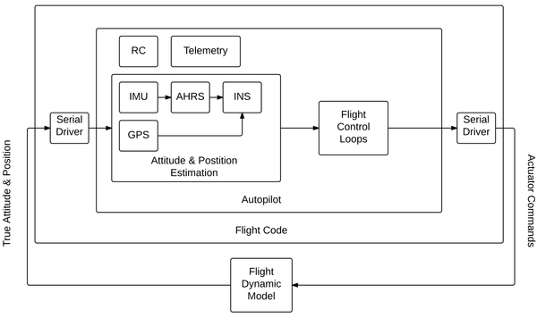
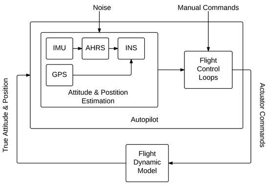

.. developer_guide simulation hitl

===========================
Hardware in the Loop
===========================

Hardware In The Loop (HITL) simulation is a way to test an embedded system (the real hardware and software) by simulating its environment, 
ie. sensor inputs, and comparing its output, ie. actuator outputs, to expected output values. 
It is the closest to an actual flight without actually flying. Using Paparazzi's Software In The Loop (SITL) and HITL for validation of a 
flight dynamics of a fixed wing UAV is in detail described in a paper "Software-and hardware-in-the-loop verification of flight dynamics 
model and flight control simulationof a fixed-wing unmanned aerial vehicle" by Cal Coopmans and Michal Podhradsky. Refer to the paper for more details.

Principle
-----------

While the SITL simulation executes the airborne code on the ground host, HITL is a way to run the autopilot code on the actual hardware in an 
environment where sensors and actuators are simulated. The difference is shown in diagrams below: SITL generates the physical behavior of 
the airplane from the Flight DynaMics (FDM) Block, then feeds the generated values into virtual sensors, the sensor inputs are processed in 
the autopilot and the autopilot control ouputs are captured and fed back into the FDM. HITL does the same, except it communicates with the autopilot over serial ports.

In HITL, two separate processes are involved:

- The real autopilot code on the control board with its own IO (for example battery voltage, etc);
- A flight model combined with a model of the actuators and the sensors.

Commands computed by the autopilot are sent to the flight model which sends back simulated values of the sensors output.

  Hardware-in-the-loop (HITL) autopilot testing block diagram

  Software-in-the-loop (SITL) autopilot testing block diagram

Limitations
-----------------

**Update March 2018: HITL currently works only with Pprzlink 1.0, please recompile paparazzi with PPRZLINK_LIB_VERSION=1.0. We are working on a fix.**

For practical reasons (it is very difficult to simulate SPI/I2C devices such as accelerometer, gyroscope etc.), 
Paparazzi HITL simulates only sensors that connect to the autopilot via serial port (for example GPS unit, or an external AHRS/INS). 
Currently implemented is Vectornav VN-200 in INS mode, but other sensors and modes can be added (i.e. VN-200 as IMU, Xsens INS etc.). 
Because the benefit of HITL is to test the autopilot code that is identical to the actual flight code, no other means of transporting 
sensor data to the autopilot are currently supported (such as sending them through uplink).

Another consideration is the bandwidth of the system - the sensor data and the actuator values have to be send/received at ``PERIODIC_FREQUENCY`` (between 40-512 Hz) for HITL to work correctly.

When to use SITL and when HITL?
------------------------------------

The advantage of SITL is that it is easy to deploy and test, because no additional hardware is needed. This means that simulation is very self-contained. 
Ideally use for testing flight plans, or initial tuning of airframes. SITL can run faster than real time.

HITL is the simulation closest to real flight, because both the hardware and the code are identical to the set being used in real flight 
the autopilot is really flying with artificial sensor data. HITL is used to test the flight hardware, once the flight plan and initial tuning 
has been configured. Usually HITL is the last thing to run before going flying.

Prerequisites
--------------------

HITL currently (Ubuntu 16.04) needs the following two steps to run correctly:

- set rtpriority for the uart threads detailes here_ by adding these two lines to your ``/etc/security/limits.conf`` file:

.. _here: https://stackoverflow.com/questions/8111302/why-does-pthread-setschedparam-produce-eperm-on-opensuse-11-4

.. code_block:: php

  domain       type    item     value
  $USER       soft    rtprio   100
  $USER       hard    rtprio   100

  where $USER is your username

- install pyserial package (needed for SBUS Fakerator), typically with sudo install ``pyserial``

