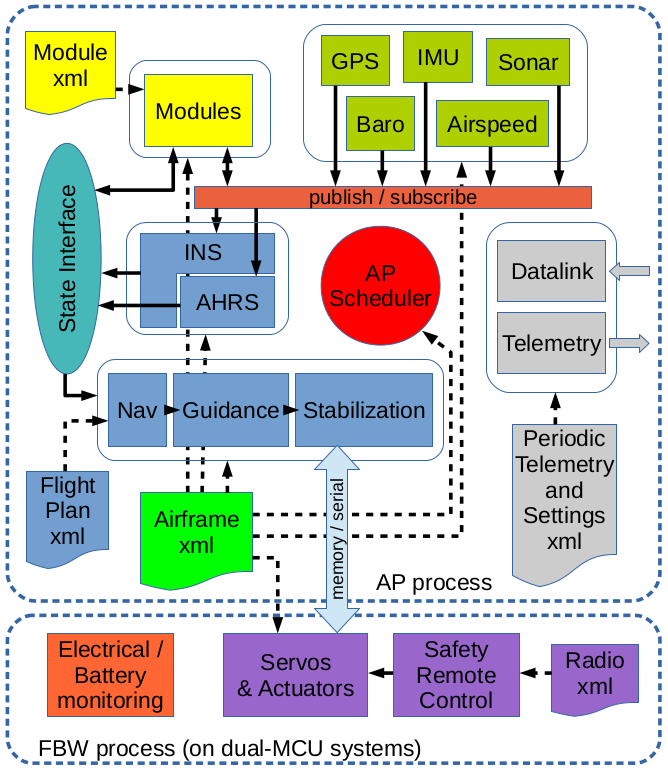

.. developer_guide system_overview

=========================
System Architecture
=========================

The typical configuration constitute of a standard laptop as ground station and one or more drones, possibly with a RC transmitter for each as safety link. The Command and Control link is made by a pair of modems on the ground and in the drones.

.. image:: general_arch.png

Ground architecture
-------------------

The Gound Control Station (GCS) constits of multiples programs, communicating with each other by the software bus `Ivy <https://www.eei.cena.fr/products/ivy/>`_.

.. note::

    Ivy is a simple protocol and a set of open-source (LGPL) libraries and programs that allows applications to broadcast information through text messages, with a publisher / subscriber mechanism based on regular expressions.

.. image:: agents_arch.png

The core Paparazzi programs are Link, which handle the communication with the drones, the Server, which maintain the state of all aircrafts, and the GCS, the user facing application to control the drones.

Many other tools have been developed for various use cases, they are available in the *Tools* menu of the paparazzi center. But more interesting: you can write your own tools that will interact with Paparazzi via the Ivy bus.

Airborne architecture
---------------------

In the case of a fixedwing aircraft, the airborne top level architecture is divided in two processes: the *AP* (autopilot) process which does most of the job, and the *FBW* (Fly by Wire) process. FBW manages the radio receiver and control the servos. In the catastrophic event that the AP process crashes, the aircraft can still be controlled via the RC transmitter.

For the rotorcraft, there is only one process called *Main*.

.. note::

    It is planned to make a failsafe process for rotorcraft that will allow basic stabilization and control of the drone.

.. warning::
    
    TODO: Explain airborne architecture

The aircraft is configured by various XML configuration files: *airframe*, *flight_plan*, *radio* and *telemetry*. theses will be covered in the :doc:`../user_guide/index_user_guide` section.
