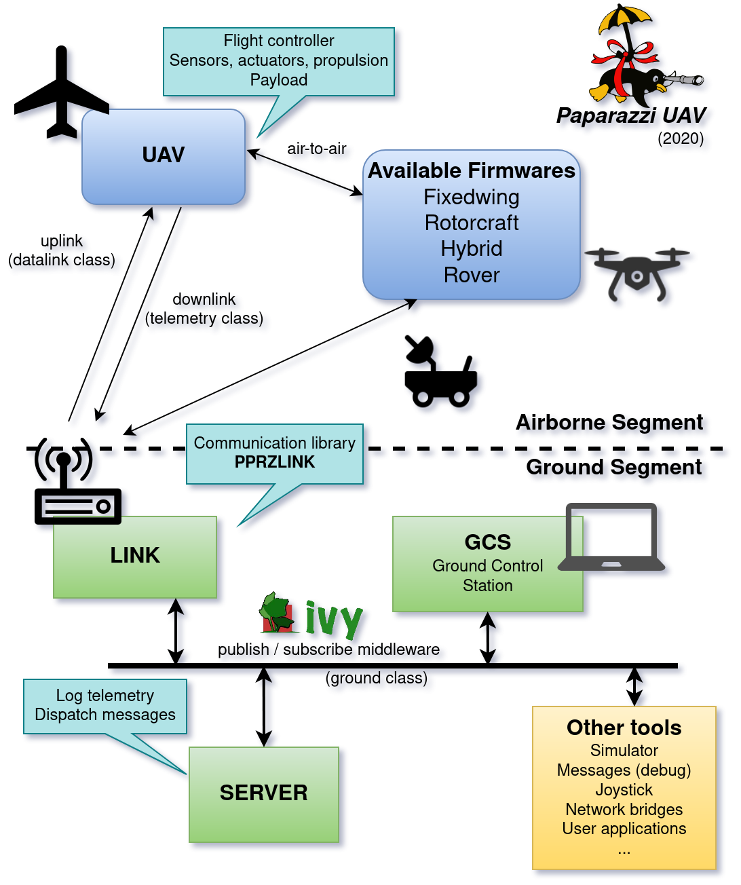
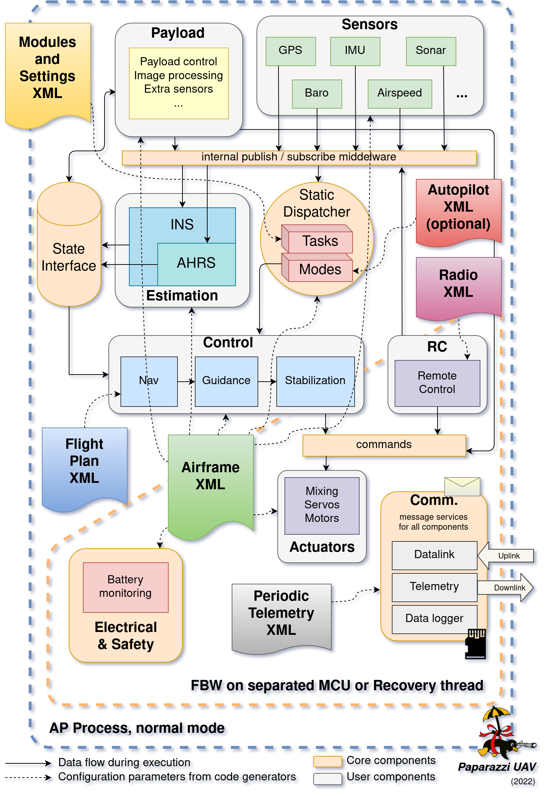
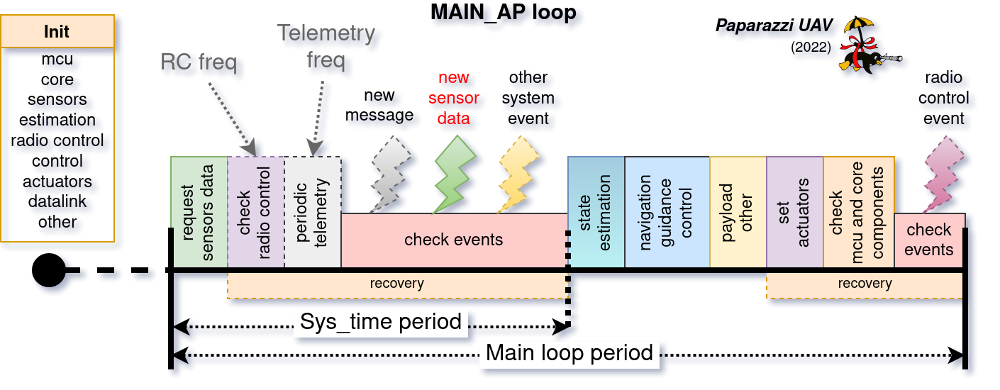
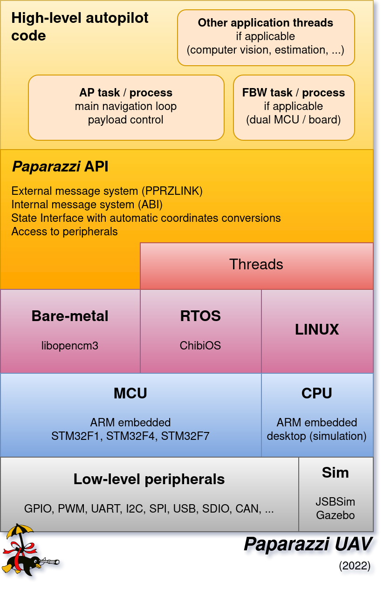

.. developer_guide system_overview

=========================
System Architecture
=========================

The typical elements that constitutes a UAV system architecture are
  - a ground segment
  - a communication segment
  - an airborne segment

In the case of the Paparazzi UAV system, the ground segment is composed by a collection of tools connected by a middleware, the communication is based on the `PPRZLINK <https://pprzlink.readthedocs.io/en/latest/>`_ library and the airborne part supports several firmwares, including fixed-wing planes, rotorcrafts, hybrids and rovers

Ground architecture
-------------------

The Ground Control Station (GCS) consists of multiples programs, communicating with each other by the software bus `Ivy <https://www.eei.cena.fr/products/ivy/>`_ (see the `documentation <https://ivybus.gitlab.io/>`_ for details), as seen on the general architecture diagram above.

.. note::

    Ivy is a simple protocol and a set of open-source (LGPL) libraries and programs that allows applications to broadcast information through text messages, with a publisher / subscriber mechanism based on regular expressions.

The core Paparazzi programs are Link, which handle the communication with the drones, the Server, which maintain the state of all aircrafts, and the GCS, the user facing application to control the drones.

Many other tools have been developed for various use cases, they are available in the *Tools* menu of the paparazzi center. But more interesting: you can write your own tools that will interact with Paparazzi via the Ivy bus.

The ground segment usually runs on a single laptop, but thanks to its distributed nature, it is also possible to split the tools on different computers connected to the same network or VPN.

Airborne architecture
---------------------

The general architecture for any UAV system aims at providing a closed loop system with perception, decision and action. The general architecture of Paparazzi is presented below:

In details:

  - Sensor data collected by the different drivers are sent to the state estimation filters (INS/AHRS blocks) through a software bus. This bus is using the publish / subscribe scheme, where data are pushed when available by the producers only to the subscribing consumers.
    Only the common definition of messages are required to connect the elements. Note that other elements can use the same bus to create interactions between payload components for instance.

  - The result of the state estimation is pushed by INS/AHRS filters to a blackboard type structure, referred as state interface.
    The main characteristic of this interface is that new data can be pushed in any supported format (e.g. Euler angles, rotation matrix
    or quaternion in the case of attitude representation), while they can be retrieved from any other components within AP process and in any format as well.
    It means that if a format transformation is required (e.g. from quaternion to Euler), the conversion is performed on the fly, only once,
    until a new update is available on the state. The available data in this interface are the position, the velocity, the acceleration,
    the orientation (attitude), the rotation speed, the air and wind speed.

  - The state is then used by the control loops for navigation, guidance and stabilization. The final commands array is stored in a normalized control vector.
    These commands are ultimately applied to the physical actuators with a mixing defined in an airframe configuration file.

  - Some other services are present, including the communication services that allow to send and receive messages from the ground, from an other aircraft
    or from an embedded companion computer. Data logging on SD card is also possible on supported hardware.
    Electrical and safety monitoring are checking the energy source to apply appropriate actions in case of voltage drop.

  - Finally, the task dispatcher is in charge of calling all the components with the correct sequence. The scheduling is statically defined
    during compilation based on the characteristics of the different modules.

.. note::

    In case of hard-fault (for instance a segmentation fault), some configurations allow to restart the MCU in failsafe mode, with a limited number of modules and services.
    In pratice, this mechanism is implemented for fixed-wing plane and activates the radio control and actuators to allow a direct control from a safety pilot,
    or to apply the failsafe position to the actuators if no inputs are provided.
    It is planned to make a failsafe process for rotorcraft that will allow basic stabilization and control of the drone.

The aircraft is configured by various XML configuration files: *airframe*, *flight_plan*, *radio* and *telemetry*. theses will be covered in the :doc:`../user_guide/index_user_guide` section.

Airborne autopilot timing
-------------------------

The picture below explain the temporal sequence of the autopilot. Each module belongs to a **task**, specified in its configuration file (or nothing for default group),
that is called in a predefined order.
The order respects the general principals of a closed loop system, but also take into account some constraints due to the use of digital sensors and performances of the microcontrollers.

The fisrt step is to call the initialization functions once a startup, and then call perdiodically the group of tasks in sequence at a fixed frequency: **PERIODIC_FREQUENCY**.

Airborne low level architecture
-------------------------------

The Paparazzi system, like many other autopilot, is built on top of embedded MCU or CPU. The next picture presents the architecture in details.

To access to the low level peripherals, several options are possible:

- *libopencm3* basic library used for the legacy bare-metal implementation. It is only used for old design and doesn't support threads.
- *ChibiOS* [*]_ is a Real-Time Operating System, providing a light real-time kernel and an hardware abstraction layer to access the peripherals.
- *Linux* is used on desktop simulation and with some drones like the Bebop from Parrot.

On top of that, the Paparazzi API provides a programming interface for the different core services and peripherals access, independent of the underlying implementation.

Finaly, the autopilot *AP* task is running the system described in section `Airborne architecture`_. If needed and applicable, some part of the code can run in dedicated threads
(e.g. computer vision, heavy payload processing, ...).

The *FBW* task is a subset of *AP*, corresponding to the remote control, actuators and battery monitoring services, that can be run on dual MCU boards (or on to separated boards).

.. note::

  A detailed description of the dual MCU configuration will be provided soon

.. [*] https://www.chibios.org

