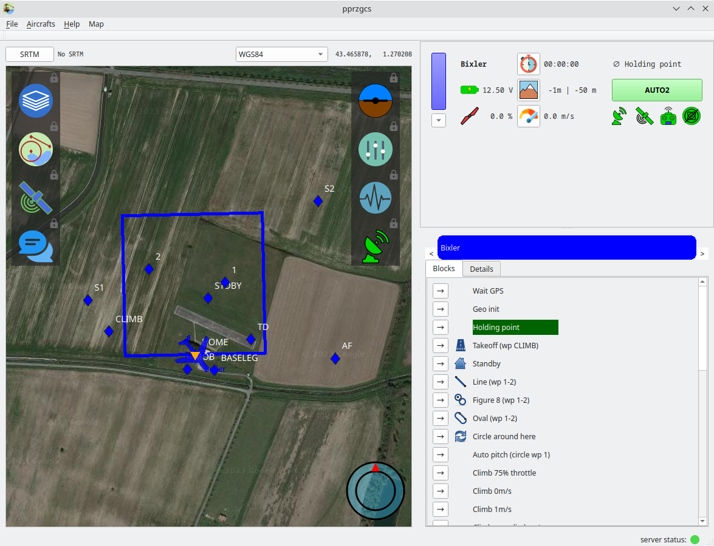

.. quickstart first_simu

======================
Flight Simulation
======================

Launch the simulation
=====================

- In the paparazzi center, select the **conf_example.xml** set (top right), then the **Bixler** aircraft (top left).
- Go to the **Configuration** tab, select the **nps** target, and click the *Build* button (gear icon). 
- Go to the Operation tab, select the **Simulation** session and launch it with the *Start session* button (play icon).
- This aircraft have two simulation target, *sim* and *nps*. Since you just build for *nps*, choose this simulator if asked for.

A new window opens, this is the GCS (Ground Control Station).

The GCS layout can be changed, but in this layout:

- The map is largest widget. Buttons opening others widgets are overlayed on the left and right side of the map.
- On the top right, this is the strip panel. Each aircraft have its own strip, which displays the state of the aircraft.
  Some icons are buttons changing displayed data. E.g. the altitude can be displayed relative to the ground or sea level.
  The arrow down button below the aircraft color displays another widget: the **command widget**.
- On the bottom right, this is the flight plan widget.

Now, lets launch the drone:

- In the flight plan, wait for the drone to be in the *Holding point* block, then put it the *Takeoff* block.
  You can also do it from the *commands* widget.
- In real life, we would now launch the drone. In simulation, there is a magic button to do so in the *commands* widget.
  Open the *commands* widget by clicking on the arrow-down button on the bottom left of the strip, and launch the drone with the *Launch* button (top left).

The drone should now move, and the current block will change to "Standby".

You can observe the status of the drone in the strip.

