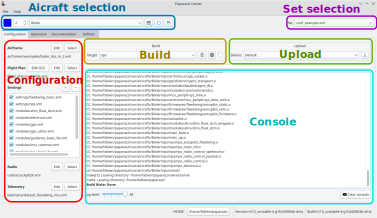
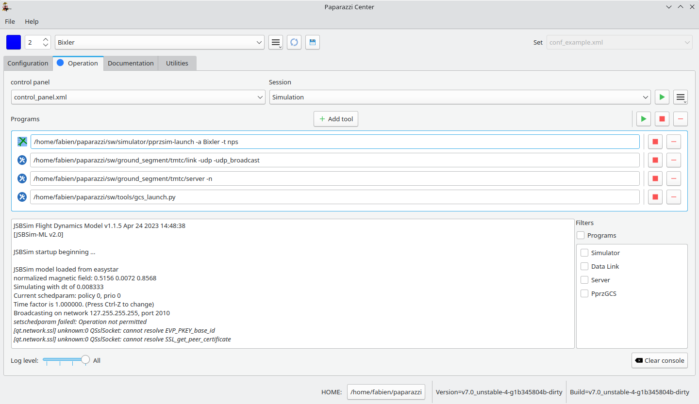

.. quickstart paparazzi_center_tour

.. _paparazzicenter:

=================
Paparazzi Center
=================

The Paparazzi Center is a graphical interface for configuring the drones and managing
the various paparazzi tools.

The drop-down on the top right corner select which set of aircrafts will be used.

Current aircraft is choosen via the top left drop-down.
The *id* on the left of the aircraft name is the **uniq** identifier of the aircraft among the set, between 0 and 255.

Configuration tab
==================

The left side of this tab is dedicated to the configuration of the aircraft.

An aircraft is composed of an airframe, a flight plan, some settings, a radio and a telemetry configuration file. These concepts are explained later.

For now, remember that you can select other files, or edit the current file with the button.

.. note::

    The ``Edit`` button open the file with *gedit* by default. You can change it via ``File->Edit Settings->Text Editor``.

Once the aircraft is configured, the firmware can be build for a target. 

Some usual targets are:

- **sim**: This basic fixedwing simulator has no IMU simulation or any sensor models (noise, bias, etc) and is mainly intended to validate your flight plan logic.
- **nps**: NPS is a more advanced rotorcraft and fixedwing simulator with sensor models and commonly uses JSBSim as FDM (Flight Dynamic Model).
- **ap**: This is for a *real* autopilot.

If the selected target is not a simulator, you can choose how you want to upload the
firmware to your autopilot, then flash it.

Compilation output is shown in the console below.

Operation tab
=============

Sessions are a collection of tools with their arguments.
Sessions are saved in ``.*control_panel.xml`` files.
The left side drop-down select which control panel you are using.

Once a session is launched, the tools are listed below.
Each tool can be stopped/restarted, and removed from the list.

The buttons above the tools list apply to all tools.

Tools can be added to the current session with the *Add tools* button.
Don't forget to save the session if you want to keep this tool for next time!

The output of the tools is shown in the text area below.

Console panel
==============

Now, lets launch a :doc:`first_simulation`!

