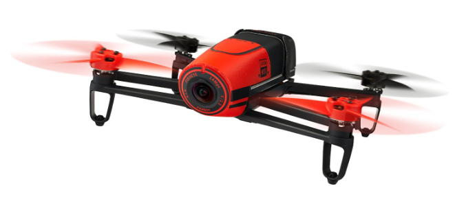
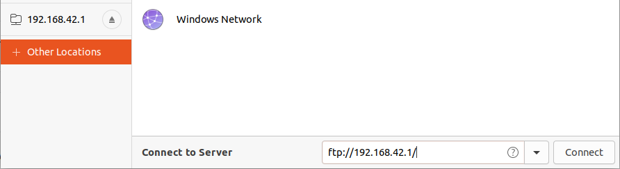

.. library airframes bebop1

======================
Bebop I
======================

The Bebop I drone is a consumer quadcopter developed by Parrot and is excellent for research as it is cheap and highly resistant to impacts. An elevated 
number of airframes configurations are available for this vehicle and each provide several interesting features and functionalities.

Specs
=================

TBD

Flashing
=================

Once the correct code for the Bebop I is compiled, it can be uploaded to the vehicle via Wi-Fi. The steps to take are as follows:

* turn on the Bebop I by pressing the ON button on the back until its light is solid green
* press the ON button rapidly for 4 times to enable the developer mode
* connect to the drone via Wi-Fi
* upload the code through Paparazzi Center

You can also `cd` into the vehicle by typing the following in the command prompt of your machine

.. code-block:: xml

    telnet 192.168.42.1

or, if using Ubuntu, connect to the server through the command

.. code-block:: xml

    ftp://192.168.42.1/

as shown in the screenshot below

Available Configurations
==================================

The number of available airframes that can be flashed on the Bebop I drone is wide and can be summed up in the list below

.. list-table:: Bebop I Airframe Configurations
   :widths: 25 25 70
   :header-rows: 1

   * - File Name
     - Directory
     - Description
   * - bebop_indi.xml
     - tu_delft
     - Controller running with INDI control strategy for both inner and outer loop
   * - bebop_course_orangeavoid.xml
     - tu_delft
     - Controller that uses frontal visual input to detect and avoid orange poles