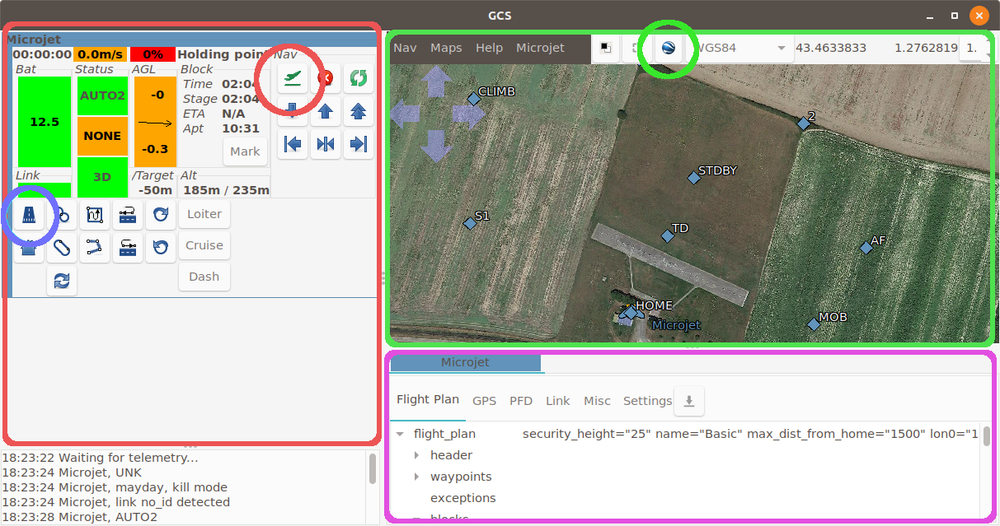
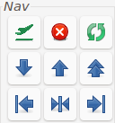
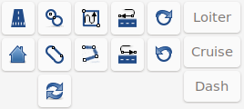

.. quickstart gcs_tour

.. _gcs:

====
GCS
====

The GCS is the main app used during the flight. Let's explore the 3 important panels.

The Strips
==========

The strips panel is the red one on the left.

Aircraft status
+++++++++++++++

Starting from the top left corner to the bottom right we have:

.. image:: gcs_strip_1.png

- flight time
- ground speed. Hover on the ground speed to get the airspeed.
- throttle level (red background means throttle is killed. Orange otherwise.)
- name of the current navigation block
- Next line, the battery voltage. This widget also display a graph of the battery voltage over time.
- three status widgets:

    + The navigation mode (AUTO2, AUTO1, MANU, ...),
    + the radio command status,
    + the GPS status.
- the height above ground level (AGL) in meters and the vertical speed (in m/s).
- the "Block" group gives:

  + the block time (time since the drone is in the current block),
  + the stage time (stages are block childs),
  + the estimated time of arrival to the next waypoint (if applicable).
  + a "Mark" button to mark on the map the current position of the drone.

- Next line, below the *Bat*, this is the *Link* status. If link is lost, the number of seconds since the last message will be displayed here.
- At the right of the GPS status, this is the altitude of the drone compared to the target altitude.
- The next group display the drone altitude and the target altitude (MSL).

*Nav* group
+++++++++++

This group features some quick operations. From the top left corner:

- the "Lauch" button, used for simulation only.
- the "Kill" button. It kills the drone throttle.
- "Resurrect" enables throttle back.
- decrease altitude
- increase altitude
- greatly increase altitude
- shift trajectory to the left
- recenter trajectory
- shift trajectory to the right

Commands
++++++++

This group features user-defined buttons that can be used to either go to a flight plan block or to sets a specific value to a setting.

The map
=======

The map displays drones and waypoint positions. Waypoints can be moved by dragging them or clicking on them. Change the altitude and confirm the new position in the dialog window that will open.

Mouse position in various reference system is displayed on the top right corner (default is WGS84).

Click the google Earth icon to load the background map.

Aircraft panel
==============

The purple panel at the bottom is the Aircraft panel.

The **Flight Plan** tab display the full flight plan of the aircraft. Double clicking on a block makes the aircraft go to this block.

The **GPS** tab gives you info about GPS state. Its usually a good idea to wait for the *Pos accuracy* to be good enough (around 5 meters or less) before proceeding to a flight.

The **PFD** tab diplay a primary flight display. Very useful for the ground checks before take off, and if the aircraft is out of sight.

The **Link** tab gives detailed info about the link with the drone.

The **Settings** tab features all settings. Settings are hierarchically organised. Each setting is displayed as follow:

- name of the setting. 
- its last known value. Click on it to update it. **?** means that the value is unknown.
- a mean to set a new value : it can be a drop-down box, radio buttons, or a slider.
- 2 buttons: the *Commit* button that will send the setting to the drone, and the *Undo* button that will set the setting back to its last value.

