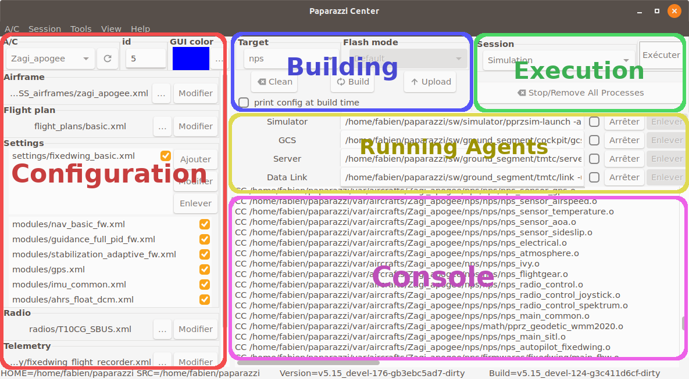

.. quickstart paparazzi_center_tour

=================
Paparazzi Center
=================

The Paparazzi Center is composed of 5 panels, as shown in the image below.

Configuration panel
====================

This panel is dedicated to the configuration of the aircrafts. You can change the current aircraft with the *A/C* combobox.

The *id* field is the **uniq** identifier of the aircraft, between 0 and 255.

An aircraft is composed of an airframe, a flight plan, some settings, a radio and a telemetry configuration file. These concepts are explained later.

For now, remember that you can select other files by hitting the ``...`` button, or edit the current file with the ``Edit`` button.

.. note::

    The ``Edit`` button open the file with *gedit* by default. You can change it by setting the ``EDITOR`` environnement variable.

Building panel
===============

This panel lets you choose for which target you want to build the firmware with the **Target** combobox. Build and clean the firmware with the *Build* and *Clean* buttons.

Some usual targets are:

- **sim**: The basic fixedwing simulator written in OCaml without IMU simulation or any sensor models (noise, bias, etc) and mainly intended to validate your flight plan logic.
- **nps**: NPS is a more advanced rotorcraft and fixedwing simulator with sensor models and commonly uses JSBSim as FDM (Flight Dynamic Model).
- **ap**: This is for a *real* autopilot.

If the selected target is not a simulator, you can choose how you want to flash the board by choosing the **Flash mode**. Click on *Upload* to load the firmware on the board.

Execution and Running agents panels
====================================

In the Execution panel, a combo box provides a set of sessions (collections of programs).

The Simulation session runs a server, a GCS and a simulator for the aircraft selected in the configuration panel. Note that *sim* or *nps* target must have been built prior to the simulation.

The launched programs can be stopped and restarted individually (Stop/Redo buttons). All programs can be stopped and removed from the list at once by the *Stop/Remove All Processes* button. A common mistake is to have multiple instances of the same program running. This button is very handy to use!

Console panel
==============

All messages from the programs run from the Paparazzi center will be displayed here. Error messages will be display in red, warnings in orange, and messages in green.

Now, lets launch a :doc:`first_simulation`!

