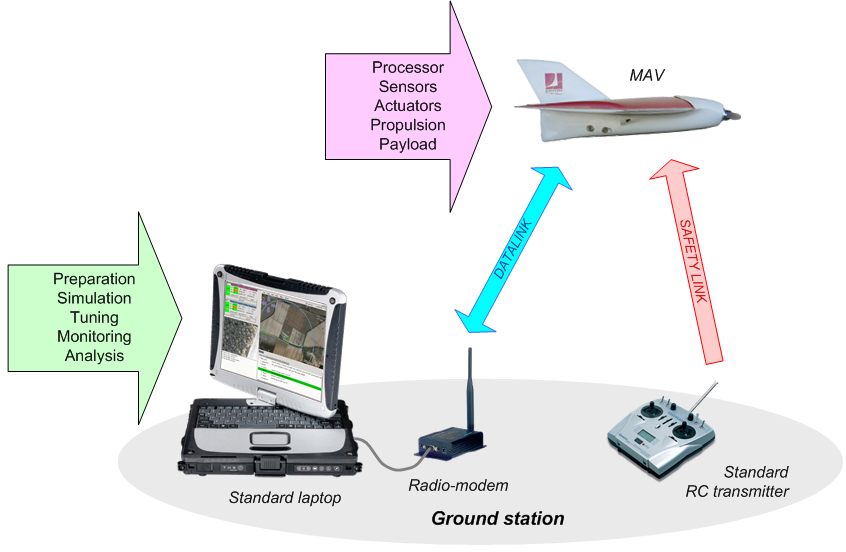
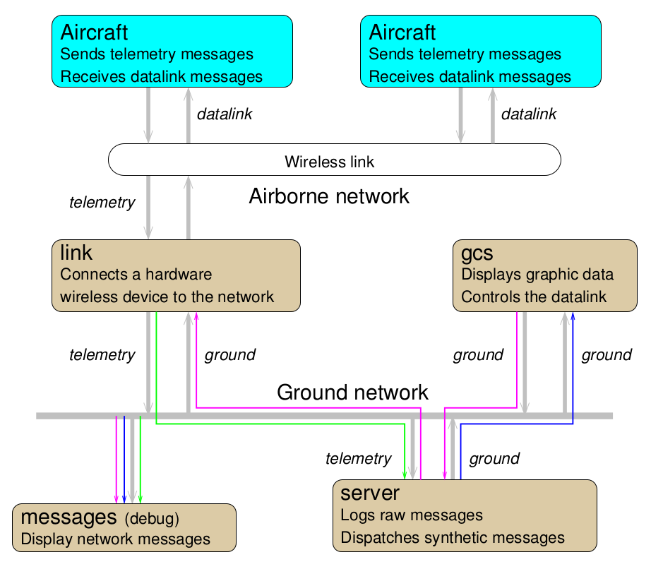

.. quickstart system_overview

========================
Overall System Overview
========================

The typical configuration constitute of a standard laptop as ground station and one or more drones, possibly with a RC transmitter for each as safety link. The Command and Control link is made by a pair of modems on the ground and in the drones.

The Gound Control Station (GCS) constitute of multiples programs, communicating with each other by a software bus.

The core Paparazzi ground programs are Link, which handle the communication with the drones, the Server, which maintain the state of all aircrafts, and the GCS, the user facing application to control the drones.

Many other tools have been developed for various use case, they are available in the *Tools* menu of the paparazzi center.

