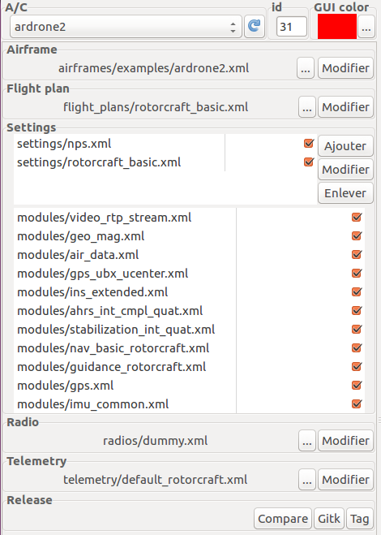
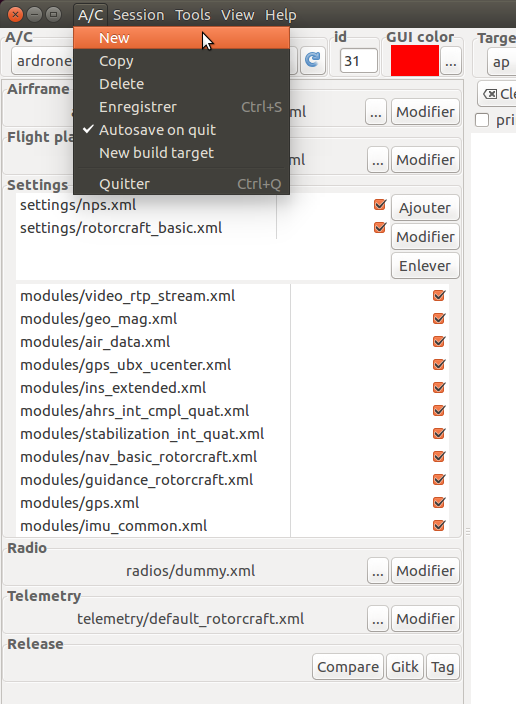

.. tutorials main_tutorials beginner add_drones

=========================
Add Drones
=========================

In this quick tutorial, you will learn what is an Aircarft (A/C) in the paparazzi vocabulary, then how to add one.

In the paparazzi center, the left side is the Aircraft configuration area.
An aircraft is a set of configuration featuring an airframe, a flight plan, some settings and modules, a radio and a telemetry.

    
    The configuration area

We will go throught a quick explainnation of each of these items, then we will see how to create a new A/C.

Configuration items
===================

* The first thing you see at the top is a drop-down box allowing you to select which A/C configuration you want. The refresh button next to this box allows you to refresh the A/C list in case you change the configuration files while the paparazzi center is running.

* The "id" box set the A/C ID. Each A/C should have a different ID since they are identified by this ID.

* The "GUI color" allows you to change the A/C color on the GCS by clicking the the "..." button.

* The airframe section refers to an airframe file. You can change the file with the "..." button, or edit it with the "Edit" button. To learn more about airframe files, see [link soon].

* The Flight plan section configure which flight plan your drone is going to fly. You can change the file with the "..." button, or edit it with the "Edit" button. To learn more about flight plans, see [link soon].

* The Settings section list all settings and modules you will use. You can add, remove or modify settings with the buttons on the right. The module list is filled according to the airframe and the flight plan files. You can untick modules and settings via the checkbox on the right. To learn more about settings and modules, see [link soon].

* The radio section configure radio settings. Select the file matching your radio. To learn more about radios, see :doc:`../intermediate/create_radio`.

* The telemetry section configure the telemetry settings. Select the file matching your needs. `default_fixedwing.xml` or `default_rotorcraft.xml` is usualy a good choice. To learn more about telemetry, see [link soon].

How to create a new A/C
=======================

To create a new Aircraft, click on the "A/C" menu, then "New".

    
A new window will appear. Give the name of your new aircraft, then click "Ok".
Your aircraft is created.

Now you have to configure each item saw in the previous section.
You can change the files by clicking on the "..." buttons, or edit the current one with the "Edit" button.

