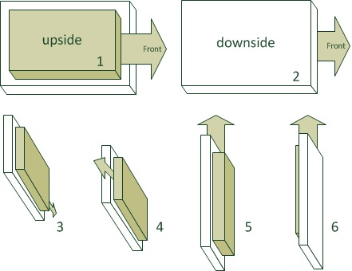
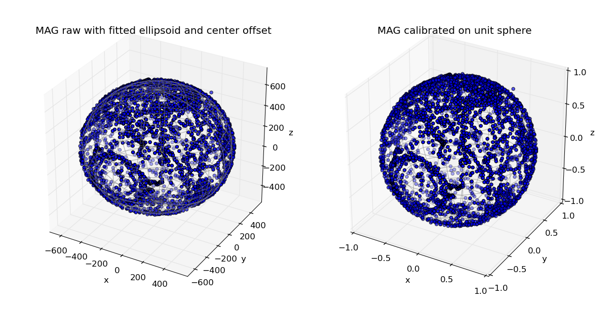

.. tutorials beginner sensor_calibration

======================
Sensor Calibration
======================

The Accelerometers and magnetometers must be calibrated for the drone to fly correctly.

Accelerometer calibration
==========================

1. Flash the board with your normal AP firmware (if it is not already on it.)
2. Switch to the "raw sensors" telemetry mode in the GCS via Settings->Telemetry and make sure that *Server* is running without the ``-n`` option.

.. figure:: raw_sensors.jpg
    :alt: How to set raw sensors telemetry
    :align: center

    Set raw sensors telemetry mode

3. Move your IMU/airframe into different positions to record relevant measurements for each IMU axis.

  + It is important that you get the min/max sensor values on each axis: turn and hold the IMU on all six sides of the 'cube' for about 10 seconds per IMU axis.
  + During theses 10 seconds, the IMU must be absolutely static. Don't hold it in your hands as you will introduce too much vibrations, prefer holding it on a wall.

.. note::

    We talk about the **IMU axis** here, not the drone's axis. So be carrefull if IMU axis are not aligned with the drone's axis.
    

    Orientations during accelerometer calibration

4. Stop the server so it will write the log file (to var/logs).
5. Run the Python script on it to get your calibration coefficients and add them to your airframe file:
    
    + run the script:

        ``sw/tools/calibration/calibrate.py -s ACCEL -p var/logs/YY_MM_DD__hh_mm_ss.data``
        
    .. note::

        The calibration script needs scipy and matplotlib python libraries. If you don't have these, install them with ``sudo apt install python3-scipy python3-matplotlib``.

    + If the log file contains logs from more than one aircraft, you will need to use the ``-i <ac_id>`` option, e.g : 

        ``sw/tools/calibration/calibrate.py -i 50 -s ACCEL -p var/logs/YY_MM_DD__hh_mm_ss.data``
    + If you kept the ``-p`` option, the script will show the plots.
    + Add (or replace) the output values from this script to the airframe file in the `IMU` section. For example:
        
        .. code-block:: xml

          <section name="IMU" prefix="IMU_">
            <define name="ACCEL_X_NEUTRAL" value="-40"/>
            <define name="ACCEL_Y_NEUTRAL" value="32"/>
            <define name="ACCEL_Z_NEUTRAL" value="-33"/>
            <define name="ACCEL_X_SENS" value="2.45746358482" integer="16"/>
            <define name="ACCEL_Y_SENS" value="2.46030721866" integer="16"/>
            <define name="ACCEL_Z_SENS" value="2.46583755829" integer="16"/>
            ...
          </section>

.. note::
    For the accelerometer calibration, your autopilot board does not necessarily need to be in your drone's airframe as it depends only on the specific accelerometer chip you have.
    
Magnetometer calibration
=========================

The procedure is very much similar to accelerometer calibration with two differences:

+ On step 3, Slowly spin your aircraft around all axes. Ideally you would spin it around all axes until you have densely covered the whole sphere with magnetometer measurements. (See figure below)
+ On step 5, use the ``MAG`` argument:
 
    ``sw/tools/calibration/calibrate.py -s MAG -p var/logs/YY_MM_DD__hh_mm_ss.data``

    A good calibration set
    
Copy the XML output in the *IMU* section of your airframe file.

.. note::
    For the magnetometer calibration, your autopilot board **needs** to be in your drone's airframe as it depends on all interferences of the environment, like the wires around the magnetometer, the position of the battery, and maybe the position of saturn in the sky.

IMU orientation
================

The drone must know how your IMU is oriented.

The drone axis are defined like so:

- Z is vertical down, aligned with the gravity
- X is toward the front of the drone
- Y is to right of the drone

.. figure:: plane_axis.png
    :alt: Plane axis
    :align: center
    
    Drone axis

According to how you mounted the autopilot board/IMU in the drone, the IMU axes are not necessarily aligned with the drone's axes.

Check if the axes are correct by watching the IMU_ACCEL message:

- Put your drone on its natural attitude. **az** value should be approx **-10**, **ax** and **ay** being around **0**.
- Nose down **ax** is **-10**, **ay** and **az** are **0**
- Right wing down, **ay** is **-10**, **ax** and **az** are **0**

If the signs are not correct (10 instead of -10), change them in the following lines :

.. code-block:: xml

  <section name="IMU" prefix="IMU_">
    ...
    <define name="ACCEL_X_SIGN" value="-1"/>
    <define name="ACCEL_Y_SIGN" value="1"/>
    <define name="ACCEL_Z_SIGN" value="-1"/>
    ...
  </section>

.. note::

    If the axis are not correct (e.g. X and Y should be swaped), you can switch them, however this is driver dependent. Here is an example for the Apogee autopilot, where X and Y are swaped:

    .. code-block:: xml

      <section name="IMU" prefix="IMU_">
        ...
        <define name="APOGEE_CHAN_X" value="1"/>
        <define name="APOGEE_CHAN_Y" value="0"/>
        <define name="APOGEE_CHAN_Z" value="2"/>
        ...
      </section>

You have to do the same thing for the GYRO signs. It is very likely that you will use the same signs as the ACCEL signs.

.. code-block:: xml

  <section name="IMU" prefix="IMU_">
    ...
    <define name="GYRO_P_SIGN" value="-1"/>
    <define name="GYRO_Q_SIGN" value="1"/>
    <define name="GYRO_R_SIGN" value="-1"/>
    ...
  </section>

To check gyro signs, watch the IMU_GYRO message:

- **gp** must be positive when banking to the right (gq and gr approx 0)
- **gq** must be positive when pitching up (gp and gr approx 0)
- **gr** must be positive when heading clockwise from top view (gq and gq approx 0)

.. note::

    The gyrometers measures rotation **speeds**, so if e.g. you bank the drone 45° right and stop, **gp** will increase, then come back to 0.

The resulting axes must form direct (right-handed) coordinates. That means that you will most probaly have a even number of changes: either two negative signs, or one negative sign and two axes swaped.

Finally, flash the drone with your modifications, then check the PFD. put the drone down and wait for 20-40s. If it turn, you have a bad setting. Then Check the directions of pitch up, pitch down, and rolls. For each check, rotate the drone by approx 20 degrees and wait. If the PFD move back, you probably miss a negative sign.

The IMU may not be perfectly aligned with the drone body. In this case, you can use the BODY_TO_IMU defines:

.. code-block:: xml

  <section name="IMU" prefix="IMU_">
    ...
    <define name="BODY_TO_IMU_PHI" value="0" unit="deg"/>
    <define name="BODY_TO_IMU_THETA" value="3.0" unit="deg"/>
    <define name="BODY_TO_IMU_PSI" value="0." unit="deg"/>
    ...
  </section>

- PHI is the roll axis (around X)
- THETA is along the pitch axis (around Y)
- PSI is along the yaw axis (around Z)

In the example above from a fixedwing, BODY_TO_IMU_THETA is set to 3 degrees for the drone to be slightly pitching up. 

