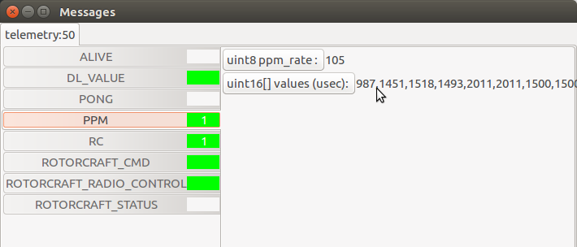

.. tutorials intermediate

================================
Create a new radio configuration
================================

In this tutotial, you will learn how to create or modify a radio configuration file to use your radio with paparazzi.

For this tutorial, you need to have a working telemetry.

Before starting, you have to bind your radio to the receiver, and configure your radio to send all needed channels. See the documentation of your radio and receiver to do it. For some radios, there is nothing to configure, but for others, you will have to select the channels you want to send. The configuration depend on your radio so it will not be explained here, but you will be able to know if all needed channels are send.

Fist, power-on your radio and your drone, and start a session with the needed processes to fly a drone : you should at least launch the *Server*, the *Data Link* and the *GCS*.

Wait to have link with the drone, then set the telemetry mode to *ppm*.

To change the telemetry mode, go on the *Settings* tab, then *System* and *Telemetry*. Select *ppm* in the drop down box and send this command to the drone by hitting the commit button. Wait for the drone to be in *ppm* mode. (The label at the left of the drop down box should change to *ppm* shortly after hitting the commit button.)

.. image:: ppm_mode.png
    :alt: Set telemetry in PPM mode.
    :align: center

Once you are in *ppm* mode, go to the paparazzi center, then launch the "Messages" process (*Tools* -> *Messages*).

You should see a *PPM* section. Click on it to display the values, shown coma separated. If you move the joystick on your radio, the values should change. Check if all needed axis are working, including mode switch and kill switch. If this is not he case, the problem is most probably coming from your radio.

Go in ``$PAPARAZZI_SRC/conf/radio`` and copy the ``dummy.xml`` file with the name of your radio. Edit it, and modify the ``name`` attribute of the ``radio`` tag with your radio name.
Add as many channel as wanted, based on the following example :

.. code-block:: xml

    <radio name="My own FrSky X9D" data_min="900" data_max="2100" sync_min ="5000" sync_max ="15000" pulse_type="POSITIVE">
        <channel function="ROLL"     min="987" neutral="1503" max="2011" average="0"/>
        <channel function="PITCH"    min="987" neutral="1451" max="2011" average="0" reverse="1"/>
        <channel function="YAW"      min="990" neutral="1500" max="2011" average="0"/>
        <channel function="THROTTLE" min="998" neutral="998" max="2011" average="0"/>
        <channel function="MODE"    min="987" neutral="1500" max="2011" average="1"/>
    </radio>

You should at least have these four channels to control your drone. The last one is for the mode selection.

It is essential that the order of these lines match the order of the channels in the *Messages* process.

For each channel, move the joystick to its neutral position, then to the extremes positions, and look at the values displayed in the *Messages* process. Write these values in the ``neutral``, ``min`` and ``max`` attributes of the corresponding channel in your radio file. The min value shall be inferior to the max value. If the channel needs to be reversed, set the ``reverse`` attribute to ``1``, such as in the *PITCH* channel of the above example.

.. note::

    For the THROTTLE channel, set the neutral position at the minimum throttle position.

.. warning::

    The old way of reversing a channel was to switch the *min* and *max* attributes. This is still working for compatibility reasons, but it is deprecated and will be an error in the next major release. Please use the *reverse* attibute.
    
.. warning::

    There used to be a *ctl* attribute. This is now deprecated, and it have never been used anyway, so remove it if you still have it in your file.

Make sure that the *data_min* and *data_max* attributes are respectively lower and higher than the min and max values you picked up.

See the comments in the radios file for more details.

Kill switch configuration
=========================

For safety reasons, it's a good practise to configure a kill switch before doing any flights with your drone.

To do it, add at the correct position the following channel, and adjust the min, neutral and max values according to your radio.

.. code-block:: xml

    
    <channel ctl="KILL" function="GEAR"   min="987" neutral="1500" max="2011" average="1"/>

Then, in the airframe file, add the following define to the ``radio_control`` module. Create it if necessary :

.. code-block:: xml

    <define name="RADIO_KILL_SWITCH" value="RADIO_GEAR"/>
    

The result should looks like that, with some differences according to your configuration :

.. code-block:: xml

    <module name="radio_control" type="sbus">
      <define name="RADIO_KILL_SWITCH" value="RADIO_GEAR"/>
    </module>

