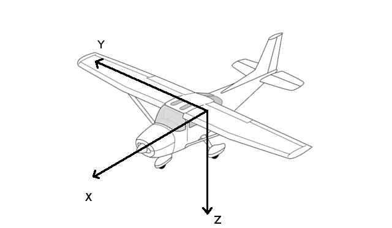
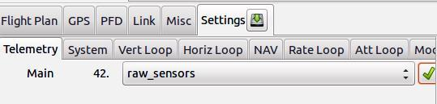
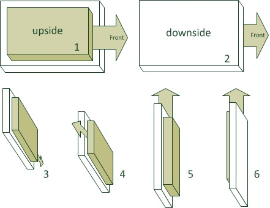

.. user_guide main_user software airframe airframe_conf imu_configuration

=================
IMU Configuration
=================

The IMU is used by the drone to get its attitude and its angular speed around its axis. It is composed of 3 accelerometers and 3 gyroscopes. Some chip also embbed 3 magnetometers. This device needs to be calibrated, and the drone needs to know how it is fixed to its frame.

See http://wiki.paparazziuav.org/wiki/ImuCalibration for more details.

The accelerometers and gyro calibration is relative to the physical device you have. The magneto calibration is relative to the physival device AND the environment, i.e. the drone itself (battery, GPS...).

Accelerometer configuration
============================

**Add the IMU module**

In your airframe file in the `firmware` section, add the `imu` module corresponding to your hardware (Replace `apogee` in the example below.) :

    .. code-block:: xml
    
      <firmware name="fixedwing">
        ...
        <module name="imu" type="apogee">
        ...
      </firmware>

**Get the axis right !**

The drone must know how your IMU is oriented.

    
    Plane axis
    

Accelerometer calibration
==========================

Here is the procedure: 

1. Flash the board with your normal AP firmware (if it is not already on it.)
2. Switch to the "raw sensors" telemetry mode via GCS->Settings->Telemetry and launch "server" to record a log.

    How to set raw sensors telemetry

3. Move your IMU/airframe into different positions to record relevant measurements for each axis.

  + It is important that you get the min/max sensor values on each axis: turn and hold the IMU on all six sides of the 'cube' for about 10 seconds per IMU axis.
  + During theses 10 seconds, the IMU must be absolutely static. Don't hold it in your hands, you will introduce too much vibrations.
  + Please note that we talk about the IMU axes here, and not the airframe axes.

    Orientations during accelerometer calibration

4. Stop the server so it will write the log file (to var/logs).
5. Run the Python script on it to get your calibration coefficients and add them to your airframe file.
    
    + run the script:

        ``sw/tools/calibration/calibrate.py -s ACCEL -p var/logs/YY_MM_DD__hh_mm_ss.data``

    + If the log file contains logs from more than one aircraft, you will need to use the ``-i <ac_id>`` option, e.g : 

        ``sw/tools/calibration/calibrate.py -i 50 -s ACCEL -p var/logs/YY_MM_DD__hh_mm_ss.data``
    + If you kept the ``-p`` option, the script will show the plots.
    + Add (or replace) the output values from this script to the airframe file in the `IMU` section. For example:
        
        .. code-block:: xml

          <section name="IMU" prefix="IMU_">
            <define name="ACCEL_X_NEUTRAL" value="-40"/>
            <define name="ACCEL_Y_NEUTRAL" value="32"/>
            <define name="ACCEL_Z_NEUTRAL" value="-33"/>
            <define name="ACCEL_X_SENS" value="2.45746358482" integer="16"/>
            <define name="ACCEL_Y_SENS" value="2.46030721866" integer="16"/>
            <define name="ACCEL_Z_SENS" value="2.46583755829" integer="16"/>
            ...
          </section>

