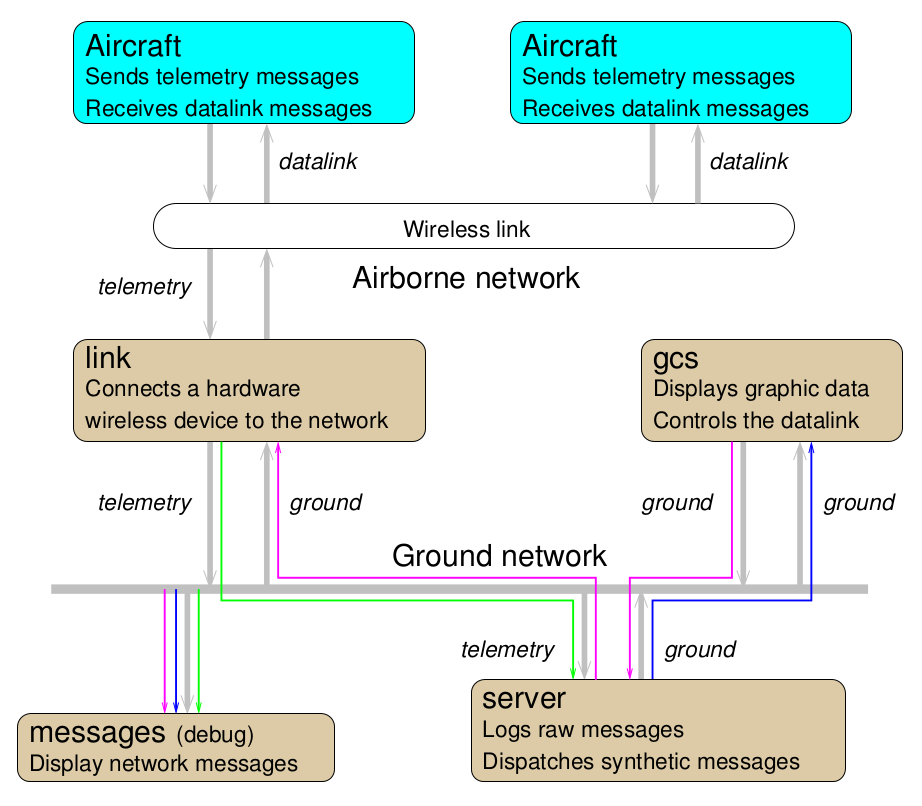

.. user_guide communication

=============
Communication
=============

This section will cover the communication in Paparazzi.

Communication in Paparazzi is achieved by the toolkit named **PprzLink**, which doc can be found `here <https://pprzlink.readthedocs.io/en/latest/>`_, and code is `there <https://github.com/paparazzi/pprzlink>`_.

Messages are divided in 5 classes:

- **Telemetry**: telemetry messages are sent by the drone to the ground station.
- **Datalink**: datalink messages are sent by the ground station to the drone.
- **Ground**: gound messages are sent by an agent running on the ground to an other one.
- **Alert**:
- **InterMcu**: intermcu messages are sent by a processor in the drone to an other processor within the same drone.

Existing messages can be seen on `this page <http://docs.paparazziuav.org/latest/paparazzi_messages.html>`_, which is generated from the PprzLink code. You can also see the messages in the `var/messages.xml` file, which is generated at the paparazzi compilation.

Visualising messages
--------------------

Remember the architecture ? Its time to use this *messages* tool at the bottom left!

The *messages* tool allows you to visualize all messages on the ground network.

First, start a session as explained in the :doc:`../quickstart/first_simulation` page.

Then start the *messages* tool by going in the Paparazzi Center menu and hiting *Tools -> Messages*.

After a few seconds, the new window should fill with messages name and blinking green rectangles. Click on a message name to watch its content. The green rectangle appear each time a new message is received. If you click on a low-frequency message, you will also see a count-up on this rectangle. This is the time since the reception of the last message.

There can be multiples telemetry *modes*. In the GCS (the app with the map), on the botom widget, got to the *Settings* tab, then to the *System*, and *Telemetry* sub-tabs. Change the AP settings from *default* to *minimal* and hit the commit button. You will observe in the messages app that less messages are received.

Change telemetry messages and rates
___________________________________

You can edit which messages are sent by the drone and at what rate. In the Paparazzi Center left pane, hit the telemetry ``Edit`` button. An XML file should open with a text editor.

.. note::
    
    If you want to change the default text editor, sets the ``$EDITOR`` environnement variable on your system. Paparazzi will use this editor.

Watch how the file is structured: there are *process* tags, inside which there are *mode* tags, inside which there are *message*. It matches what you seen in the GCS Telemetry settings. Don't worry too much about processes right now, keep in mind that are are mostly interested about the *Ap* process at the moment.

As an exercise, try to change the *period* of a message. This is the period in seconds at which this message will be sent by the drone. You can also add a message, picked from the telemetry message class.

For your modification to take effect, you need to re-Build the aircraft. Don't forget to *Stop/Remove all Processes* before. After building the aircraft, launch the simulation session and launch again the *messages* tool: you should now see the effects of your modifications.

