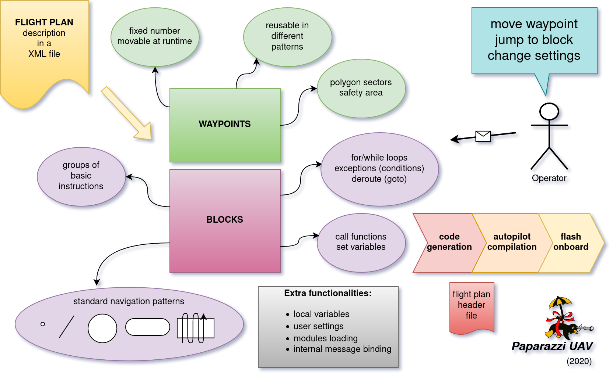

.. user_guide flight_plan

============
Flight Plans
============

A **flight plan** is a XML document that describe how you want your AC to travel. It can easily express complex behavior.

It will be translated to C code at build time, and flashed in your AC. Modifying it then requires to build again the firmware, and upload it to your AC.

A flight plan is composed of waypoints and blocks that execute instructions.

DTD and Structure
-----------------

The flight plans are stored in the ``conf/flight_plans`` directory. The flight plan editor can be used to create basic flight plans via the GUI.

The formal description of the flight plan file is given in the DTD (located in ``conf/flight_plans/flight_plan.dtd``).
This DTD must be referenced in the header of your flight plan XML document with its relative path using the following line:

.. code-block::
    
    <!DOCTYPE flight_plan SYSTEM "flight_plan.dtd">

Extract from the DTD:

.. code-block::

    <!ELEMENT flight_plan (header?,waypoints,sectors?,variables?,modules?,includes?,exceptions?,blocks)>

A flight plan is composed of two mandatory elements: waypoints and blocks.

.. warning :: The order of the elements must be respected, or the parsing will trigger an error.

The root ``flight_plan`` element is specified with several attributes:

**Mandatory attributes**:

name
    The name of the mission (a text string)
lat0, lon0
    Defines the latitude and longitude coordinates of the reference point {0,0} in WGS84 coordinates
    
max_dist_from_home
    A radius representing the maximum allowed distance (in meters) from the HOME waypoint.
    Flying outside this circle point will trigger the *home* mode.
    This behavior is overrided by the *geofence_sector* optional attribute.
    
ground_alt
    The ground altitude (in meters), Above Sea Level where you are flying.
    It defines the GROUND_ALT constant value which can be used in combination with a waypoint <height> parameter to define a waypoint height.
    
security_height
    The height (over ground_alt) used by the circle-home failsafe procedure and in other flight procedures such as formation flight and anti-collision avoidance.
    Warnings are produced if you place a waypoint **lower** than security_height (usually the case for the landing point).
    
alt
    The default altitude of waypoints (Above Sea Level).
    So if your ground altitude is 400 then alt needs to be a value greater than ground altitude and above any obstructions in the flight plan.

**Optional attributes**:

wp_frame
    Frame in wich waypoints X and Y coordinates are expressed.
    Default to ``UTM``, but can be set to ``LTP`` (`local tangent plane <https://en.wikipedia.org/wiki/Local_tangent_plane_coordinates>`_), which means that X and Y will align to east and north at the reference point.

qfu
    Defines the global constant QFU. It usually is the magnetic heading in degrees (north=0, east=90) of the runway, the opposite of wind direction. This constant may be used in the mission description. It is also used by the simulator as the original course of the aircraft. So if you want to take off and climb to the West you would use qfu=270.

home_mode_height
    Allows to override *security_height* as failsafe height in home mode. If *home_mode_height* is set lower than *security_height*, the later is used.
    This attribute is useful if you need to return home at a high altitude rather than a low altitude.

geofence_max_alt
    Flying above this altitude will trigger the *home* mode.

geofence_max_height
    Flying above this height will trigger the *home* mode.

geofence_sector
    Flying outside this sector will trigger the *home* mode.

Here is an example of such a line in the top of a flight plan:

.. code-block::

    <flight_plan alt="250" ground_alt="185" lat0="43.46223" lon0="1.27289" name="Example Muret" max_dist_from_home="300" qfu="270" security_height="25" >

Waypoints
---------

The waypoints are the geographic locations used as anchor to specify the trajectories. A waypoint is specified by it's name and coordinates.

You can't add or delete waypoints during the flight, but you can move them at any time.

.. note::
    
    There is a hard limit to max 254 waypoints, but it is usually a bad idea to use that many waypoints.
    If you have such a need, you may be interested in the **Mission** (TODO doc) mode.

Waypoint position is defined either in relative coordinates with the **x** and **y** attributes, or in absolute coordinates with the **lat** and **lon** attributes.

**alt** is an optionnal parameter that can be used to assign an altitude to a particular waypoint.
If it is not specified, the waypoint will default to the *alt* parameter of the flightplan node (see above).

The **height** attribute can be used to set the waypoint height relative to the ground altitude of the flight plan (*ground_alt*).

.. code-block::

    <waypoints>
        <waypoint name="HOME" x="0.0" y="30.0"/>
        <waypoint name="BRIDGEOVERRIVER" x="-100.0" y="60.0" alt="270."/>
        <waypoint name="MyBarn" x="-130.0" y="217.5" alt="3000."/>
        <waypoint name="_MYHELPERSPOT" x="-30.0" y="50" height="50."/>
        <waypoint name="4" x="-30.0" y="50." alt="ground_alt + 50"/>
        <waypoint name="" x="-30.0" y="60" height="50."/>
        <waypoint name="_MYOTHERHELPERSPOT" x="-70.0" y="90" height="70."/>
        <waypoint name="TOWER" lat="48.858249" lon="2.294494" height="324."/>
    </waypoints>

.. note:: Waypoints (x, y) coordinates are relative to the refence point, which is set to the first GPS fix. It can be moved by calling ``NavSetGroundReferenceHere()`` from the flight plan.

**Tips**

+ Waypoints are easily adjusted with the flight plan editor.
+ If a waypoint name starts with an underscore ( _ ), the waypoint is not displayed in the GCS, except in editor mode.
+ The maximum number of waypoints is 254.
+ A waypoint named HOME is required if the failsafe HOME mode procedure is used.
+ A waypoints index/reference pointer is derived by prefixing the waypoint name with ``WP_``. Useful when a call function uses the waypoints reference index vs. it's name.

Sectors
-------

Flat Sectors can be described as an area defined by a list of waypoint corners.
Such an area will be displayed in the Ground Control Station (GCS) by colored lines connecting the cornerpoints.
A function is generated to check if a point, usually the aircraft itself, is inside this sector.
For a sector named *MyBigGarden* the generated function for the example here would be ``bool_t InsideMyBigGarden(float x, float y);``
where x and y are east and north coordinated, in meters, relative to the geographic reference of the flight plan.
Note that sector names are not allowed to contain spaces.

.. note:: The edges of the polygon should not cross each other. 

For example, with the following element in a flight plan:

.. code-block::

    <sectors>
        <sector name="MyBigGarden" color="red">
            <corner name="_1"/>
            <corner name="_2"/>
            <corner name="_3"/>
            <corner name="_4"/>
        </sector>
    </sectors>

It is then possible to add an exception clause to your flightplan.

For example if the aircraft for some reason flies outside this sector, the airframe will fly to a standby waypoint.
The exclamation mark (!) means the boolean operator NOT in this example.
In regular language one would describe "*If my airframe is NOT inside the MyBigGarden sector anymore then deroute it to the standby waypoint*".
In Flightplan "Speak" this is written like:

.. code-block::

    <exception cond="! InsideMyBigGarden(GetPosX(), GetPosY())" deroute="standby"/>

**Tip:** The *color* attribute is optionnal. If not defined, the color will default to the AC color.

Variables
---------

It is possible to declare a list of variables that will be automatically created during the flight plan generation
and available for the rest of the system from the generated flight plan header and of course inside the flight plan itself.
With appropriate attributes, it is also possible to make the variables accessible from the telemetry as a setting.

The following code will produce a float variable initialized to 0:

.. code-block::

    <variables>
        <variable var="my_var"/>
    </variables>

The type and the initial value can be changed with the type and init attributes:

.. code-block::

    <variables>
        <variable var="my_var" init="10" type="int"/>
    </variables>

To produce an automatic setting for a variable, at least min, max and step attributes need to be specified:

.. code-block::

    <variables>
        <variable var="my_var" min="0." max="10." step="0.1"/>
    </variables>

They will appear under the Flight Plan settings tab in the GCS.
More attributes can be specified: **shortname**, **unit**, **alt_unit**, **alt_unit_coef**, **values**.
See `Settings <https://wiki.paparazziuav.org/wiki/Settings>`_ page for more information about these options. 

Modules
-------

Additional modules can be added to the airframe using the modules element inside the flight plan. The same syntax is used as in the airframe file:

.. code-block::

    <modules>
    <module name="demo_module">
      <define name="MY_DEFINE" value="0"/>
      <configure name="MY_CONF" value="0"/>
      ...
    </module>
    </modules>

.. note:: If a module is only used in the flight plan, it is obviously better to add it here, and not in the aiframe file.

Exceptions
----------

Exceptions consist in conditions checked periodically (at the same pace as the navigation control), allowing the control to jump to a given block. Here is the syntax of exceptions:

.. code-block::

    <exception cond="..." deroute="...">

where cond is an expression and deroute is the name of the block we want to switch to as soon as the condition is true. 

Here are some example of exceptions: 

.. code-block::

    <exception cond="PowerVoltage() @LT 10" deroute="go_down"/>
    <exception cond="(GetAltRef()+10 @GT GetPosAlt())" deroute="go_up"/>
    <exception cond="(autopilot_flight_time @GT 840)" deroute="quick_land"/>
    
Exceptions can be local to a block or global to the flight plan, in the ``<exceptions>`` element. 

.. admonition:: note on expressions

    Some flight plan attributes are evaluated as C expressions.

    Since some operators are not compliant with the XML specifications (``&``, ``<``, ``>`` characters are *not* allowed), you **must** use some alternate naming: 

    .. csv-table::
        :header: "C operator", "substitute", "meaning"
        
        "<", "@LT", "lower than"
        ">", "@GT", "greater than"
        "<=", "@LEQ", "lower or equal"
        ">=", "@GEQ", "greater or equal"
        "&&", "@AND", "logical AND"
        "||", "@OR", "logical OR"
        "->", "@DEREF", "pointer derefence"

Blocks
------

Block elements are the main part of a flight plan: they describe each unit of the mission. They are made of various primitives, called stages and exceptions, you can put one after the other. When a stage (or a block) is finished, the autopilot goes to the next one. The behaviour after the last stage of the last block is undefined.

As described in the DTD, the blocks element is composed of block elements which are sequence of stages: 

.. code-block::

  <!ELEMENT blocks (block+)>
  <!ELEMENT block (exception|while|heading|attitude|manual|go|xyz|set|call|call_once|circle|deroute|stay|follow|survey_rectangle|for|return|eight|oval|home|path)*>

Example:

.. code-block::
    
  <block name="circlehome">
    <circle radius="75" wp="HOME"/>
  </block>

GCS integration:

+ You can add a button in the strip of the aircraft with the attribute ``strip_button``.
+ You can specifiy an icon for that button with the ``strip_icon`` attribute. The filename specified is relative to ``data/pictures/gcs_icons``.
+ The ``key`` attribute adds a shortcut for that block.
+ Buttons will be grouped together by the optional ``group`` attribute.

.. code-block::

  <block name="StandBy" strip_button="StandBy" strip_icon="home.png" key="S" group="takeoff">
    <circle wp="STDBY" radius="nav_radius"/>
  </block>
  

You can call functions before or after each execution of the block:

.. code-block::

  <block name="circlehome" pre_call="function_to_call_before_circle()" post_call="function_to_call_after_circle()">
    <circle wp="HOME"/>
  </block>

Initialization Blocks
_____________________

Most flight plans will have three blocks of flight plan initialization blocks. It is good practice to follow this example below if you first start learning to create flightplans.

The first block waits until the GPS fix has been established, as shown below.

.. code-block::

    <block name="Wait GPS">
      <set value="1" var="kill_throttle"/>
      <while cond="!GpsFixValid()"/>
    </block>

The second block updates the local waypoints with respect to the UAV.

.. code-block::

    <block name="Geo init">
      <while cond="LessThan(NavBlockTime(), 10)"/>
      <call fun="NavSetGroundReferenceHere()"/>
    </block>

This next block prevents the UAV from starting the engine and taking off.

.. code-block::

    <block name="Holding point">
      <set value="1" var="kill_throttle"/>
      <attitude roll="0" throttle="0" vmode="throttle"/>
    </block>

Deroute
_______

The deroute is the goto directive of the flight plan; it switches the navigation to the given block:

.. code-block::

    <deroute block="landing"/>

Return
_______

The return is also a goto directive that brings you back to the last block (and last stage). It has no argument.

.. code-block::

    <return/>

Loops
_____

Unbounded loops are written with while elements whose cond attribute is a boolean expression. Children of while are stages:

.. code-block::

  <while cond="TRUE">
    <go wp="A"/>
    <go wp="B"/> 
    <go wp="C"/>
    <while cond="5 @GT stage_time"/>
   </while>

In this example, we run an infinite loop, letting the aircraft try to go via waypoints A, B and C and waiting for 5 seconds before repeating.

Bounded loops are written with the for tag:

.. code-block::

  <for var="i" from="1" to="5">
    <circle wp="HOME" radius="75" alt="GetAltRef()+50*$i" until="stage_time>10" />
  </for>

The variable of a for loop can be used inside expressions appearing as attributes of the stages when prefixed by ``$``.
In this example, the aircraft will circle around waypoint HOME for 10 seconds at an altitude above ground of 50m (1x50), 10 seconds at an altitude of 100m (2x50), ... until 250m (5x50).

.. note::

    Two bounded loops using the same control variable are not allowed in the same block.

    Further, the current implementation bounds the control variable to [-128; 126].

Navigation modes
________________

Navigation modes give the description of the desired trajectory in 3D.
While the horizontal mode is specified through stages, the vertical control is specified with various attributes of these stages.
The current available navigation stages are:

+ **attitude**: just keep a fixed attitude;
+ **heading**: keep a given course;
+ **go**: go to a given waypoint;
+ **path**: list of waypoints linked by go;
+ **circle**: circle around a waypoint;
+ **oval**: two half circles with a straight between two nav points
+ **eight**: fly a figure of eight through a waypoint and around another
+ **stay**: hold the position (for rotorcrafts);
+ **follow**: follow another aircraft;
+ **xyz**: circle around a point where XY moveable with the RC transmitter stick, Z with other stick or slider

The vertical control is achieved using the vmode attribute of these stages. The possible values are:

+ **alt** (the default): the autopilot keeps the desired altitude which is the altitude of the waypoint (if any) or the altitude specified with the ``alt`` attribute;
+ **climb**: the autopilot keeps the desired vertical speed specified with the ``climb`` attribute (in m/s);
+ **throttle**: the autopilots sets the desired throttle specified with the ``throttle`` attribute (between 0 and 1);
+ **glide**: the autopilot keeps the desired slope between two waypoints

The default control is done with the throttle. However, setting the ``pitch`` attribute to ``auto`` and the ``throttle`` attribute to a constant allows a vertical control only by controlling the attitude of the A/C. The pitch attribute also can be set to any value (in degrees) while the throttle control is in use: it usually affects the airspeed of the aircraft.

The different navigation modes are detailed in the next sections. 

Attitude
________

Element ``attitude`` is the navigation mode which corresponds to the current lowest control loop for horizontal mode. The autopilot then keeps a constant attitude. The roll attribute is required (in degrees, positive to put right wing low).

To fly away, at constant airspeed:

.. code-block::

    <attitude roll="0" vmode="throttle", throttle="0.5"/>

To fly around, holding a given altitude:

.. code-block::

    <attitude roll="30" alt="GetAltRef()+50"/>

Note that it is not a safe navigation mode since the geographic position of the plane is not controlled. However, this mode is useful to tune the roll attitude control loop.

Heading
_______

``heading`` primitive is relative to the second level loop for horizontal mode in the autopilot which will keep the given course, a required attribute (in degrees, clockwise, north=0, east=90).

One example to takeoff, following the QFU, 80% throttle, nose up (15 degrees) until height of 30m is reached:

.. code-block::

    <heading course="QFU" vmode="throttle" throttle="0.8" pitch="15" until="(GetPosAlt() @GT GetAltRef()+30)"/>

Go
__

The ``go`` primitive is probably the most useful one. Basically, the autopilot will try to join a given waypoint (``wp``, the only required attribute). So the simplest thing you can ask for is

.. code-block::

    <go wp="HOME"/>

which will set the HOME waypoint as the desired target position. Note than since ``vmode="alt"`` is the default, the altitude of the target waypoint is also taken into account. The navigation will switch to the next stage as soon as the target is reached.

It is usually not a good idea to try to join a waypoint without asking for a precise trajectory, i.e. a given line. Setting the ``hmode`` attribute to route, the navigation will go over a segment joining two waypoints:

.. code-block::
    
    <go from="wp1" wp="wp2" hmode="route"/>

The target altitude is the altitude of the target waypoint; it can also be set with the ``alt`` attribute. The following example keeps an altitude with fixed throttle:

.. code-block::

    <go from="wp2" wp="wp3" hmode="route" pitch="auto" throttle="0.75" alt="GetAltRef()+100"/>

The attributes related to the vertical control can also be set to replace the default altitude mode:

.. code-block::

    <go from="wp1" wp="wp2" hmode="route" vmode="climb" climb="1.5"/>

Finally, the ``approaching_time`` (in seconds) attribute helps to decide when the target is reached. It can be set to 0 to go over the target waypoint (default value is the CARROT time, set in the airframe configuration file).

.. code-block::

    <go from="wp1" wp="wp2" hmode="route" approaching_time="1"/>

Path
____

The ``path`` primitive is just a shorthand expression for a set of go primitives. A list of waypoints defined with the ``wpts`` attribute is pre-processed into a set of go primitives with the ``hmode`` attribute. For example:

.. code-block::

    <path wpts="wp1, wp2, wp3"/>

Other attributes are optional:

.. code-block::

    <path wpts="wp3, wp1, wp2" approaching_time="1" pitch="auto" throttle="0.5"/>

Circle
______

The ``circle`` primitive is the second main navigation mode: the trajectory is defined as a circle around a given waypoint with a given radius:

.. code-block::

    <circle wp="HOME" radius="75"/>

A positive radius makes the UAS move clockwise, a negative counter-clockwise.

The ``until`` attribute may be used to control the end of the stage. The following example defines an ascending trajectory at constant throttle, nose up (15 degrees), over growing circles, until the battery level is low:

.. code-block::

    <circle wp="wp1" radius="50+(GetPosAlt()-GetAltRef())/2" vmode="throttle" throttle="0.75" pitch="15" until="PowerVoltage() @LT 10"/>

Oval
____

The ``oval`` consists of two half circles that are connected with two straight lines.

.. code-block::

    <oval p1="1" p2="2" radius="nav_radius"/>

Eight
_____

Works only for Fixed-wing! Fly a figure of eight that consists of two straight legs that pass though the ``center`` waypoint, and turn around the ``turn_around`` waypoint and its symetry around ``center``. The altitude of the center waypoint is used for the entire figure.

.. code-block::

    <eight center="1" radius="nav_radius" turn_around="2"/>

Survey rectangle
________________

Fly a survey rectangle defined by two waypoints. The distance between the legs of the grid (in meter) and the orientation of the grid (NS or WE) can be set by the operator. The plane will turn outside of the border of the rectangle before starting a new leg.

.. code-block::

    <survey_rectangle wp1="1" wp2="2" grid="200" orientation="NS"/>

Follow
______

The follow is a special primitive which makes the UAV follow another UAV (real or simulated, named with its ac_id) at a given distance (in meters) behind and at a given height (in meters) above.

In this example, the autopilot will try to follow A/C number 4, staying 50m behind and 20m above.

.. code-block::

    <follow ac_id="4" distance="50" height="20"/>

Stay
____

The UAV will try to stay at the waypoint as best as it can. For an aircraft capable of hovering it will just hang above the waypoint. If the UAV has no hover capabilities, stay will mean the aircraft will constantly fly straight through the waypoint in a flower like pattern with the smallest turn radius it can manage.

.. code-block::

    <stay wp="HOME" alt="10"/>

Set
___

The ``set`` element is a dangerous one which should be used only by expert users: it is used to directly set an internal variable of the autopilot. For example, you can change the value of the default ground altitude, a variable used by the home mode failsafe procedure (and maybe by your own flight plan):

.. code-block::

    <set var="ground_alt" value="ground_alt+50"/>

This directive is extremely powerful and has great potential for error - use with caution.

Call, call once
_______________

``call_once`` call any C funtion, once.

``call`` call any C funtion periodically, until the function returns ``FALSE``.

This allows the user to e.g. define its own navigation procedures in C.

This feature is illustrated with the line pattern:

.. code-block::

  <call_once fun="nav_line_setup()"/>
  <call fun="nav_line_run(WP_P1, WP_P2, nav_radius)"/>

``nav_line_run()`` always returns ``TRUE`` (this stage never ends). Note that a waypoints index is derived/denoted by prefixing the waypoint name with ``WP_`` (i.e.: *P1* --> *WP_P1*, *P2* --> *WP_P2*).

Such extra navigation functions are usually written as a Module and the header files are included automatically.

If you want to call functions that are not part of a module, you need to include the header file which contains the function declaration, or supplementary C file which must be specified in the ``header`` node with a path relative to the ``sw/airborne`` directory.

Internal Variables in Flight Plans
----------------------------------

The flight plan can use several internal variables, macros and functions coming from the rest of the system or the flight plan API itself.
The following list present some of the most commonly used variables, but much more are actually available:

+ **autopilot.flight_time**: time in seconds since autopilot was booted (integer)
+ **datalink_time**: time in seconds since last connection of telemetry to ground control station (including modules/datalink/datalink.h in the header section is required) (integer)
+ **GetPosAlt()**: returns the current altitude above ground level in meter (float)
+ **GetPosX()**: returns x (easting) of current position relative to reference in meter (float)
+ **GetPosY()**: returns y (northing) of current position relative to reference in meter (float)
+ **GetAltRef()**: returns reference altitude.
+ **NavSetGroundReferenceHere()**: reset position and altitude reference point to current position
+ **NavSetAltitudeReferenceHere()**: reset altitude reference to current alt but keep previous horizontal position reference
+ **NavSetWaypointHere(_wp)**: set position of a waypoint given as argument to the current position
+ **WaypointX(_wp)**: returns x (easting) of waypoint position relative to reference in meter (float)
+ **WaypointY(_wp)**: returns y (northing) of waypoint position relative to reference in meter (float)
+ **WaypointAlt(_wp)**: returns waypoint altitude in meter (float)
+ **nav_radius**: free variable usually used to set circle radius in flight plan
+ **NavKillThrottle()**: function to switch off throttle
+ **PowerVoltage()**: returns current voltage of the battery
+ all functions from the state interface API
+ all functions from the waypoint API
+ all variables declared in modules headers

Procedures
----------

Procedures are libraries which can be included in flight plans. They are composed of waypoints, sectors and blocks.
The header of a procedure may contain some parameters which are replaced by arguments when the procedure is included. 

A parameter is just a name. A parameter is optional if it is declared with a default value. An example with a required and an optional parameter: 

.. code-block::

    <param name="alt"/>
    <param name="radius" default_value="75"/>
    
Procedures are called with the include element in a flight plan. A procedure call requires: 

+ the name of the procedure file, the name given to this inclusion
+ values for the parameters
+ backlinks for block name exits of the procedure

.. error:: TODO
    

