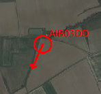
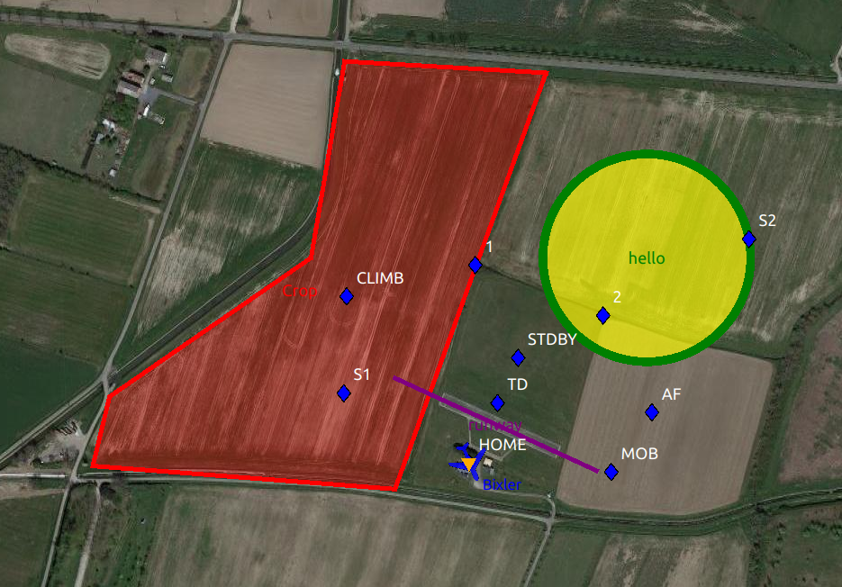
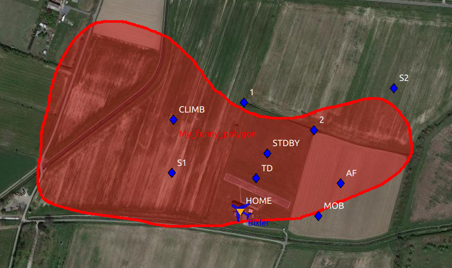

.. user_guide flight_plan

================
GCS map graphics
================

GCS map can be enriched with intruders and shapes.

Intruders
---------

Intruders represents vehicles that are not managed by paparazzi. They are updated with the `INTRUDER` message.

Intruders positions are transmitted by the server to the ACs with ACINFO messages.

The **INTRUDER** message is defined as follow:

.. code-block:: xml

    <message name="INTRUDER" id="37">
      <field name="id"     type="string"/>
      <field name="name"   type="string"/>
      <field name="lat"    type="int32"  unit="1e7deg" alt_unit="deg" alt_unit_coef="0.0000001"/>
      <field name="lon"    type="int32"  unit="1e7deg" alt_unit="deg" alt_unit_coef="0.0000001"/>
      <field name="alt"    type="int32"  unit="mm" alt_unit="m">altitude above WGS84 reference ellipsoid</field>
      <field name="course" type="float"  unit="deg"/>
      <field name="speed"  type="float" unit="m/s"/>
      <field name="climb"  type="float"  unit="m/s"/>
      <field name="itow"   type="uint32" unit="ms"/>
    </message>

Latitudes and longitudes are integers in 1e7deg: ``43.123456`` become ``431234560``.

.. note::

    You can use the **OpenSky-Network Intruders** tool (in the paparazzi center: Tools->OpenSky-Network Intruders) to view ADS-B aircrafts near your ACs.
    
    The **id** field will be the aircraft's hexadecimal ICAO 24 bits address, and the **name** field its callsign.

Shapes
------

Shapes can be drawn in the GCS by sending the **SHAPE** message defined below.

.. code-block:: xml

    <message name="SHAPE" id="38">
        <description>
          The SHAPE message used to draw shapes onto the Paparazzi GCS.
          Field name shape is used to define the type of shape i.e. Circle, Polygon, Line, or Text.
          This is indexed from 0-3 respectively.

          Each shape drawn must have an id number associated with it.
          This id number in conjuction with the shapetype will be needed to update or delete the shape.
          A circle can be defined with the same id as a polygon but since they have different shape types they are considered unique.

          linecolor and fillcolor take in a color string ie: "red", "blue"

          opacity will change the level of transparency of the fill.
          0 - Transparent
          1 - Light Fill
          2 - Medium Fill
          3 - Opaque

          Passing a status of 0 will create or update the shape specified by id and type.
          Passing a status of 1 will delete the shape specified by id and type.

          latarr is an array of coordinates that contain the latitude coordinate for each point in the shape.
          The array is comma separated.
          lonarr is similar to latarr but contain the longitude coordinate for each point in the shape.

          Circle and Text type will take the first coordinates given to place the shape.
          Polygon will take all the coordinates given.
          Line will take the first two coordinates given.

          Radius is only used for the circle.

          Text will always be populated with each message using the first set of coordinates.
          The text field can not be blank or have spaces.
          If text is not desired for a shape then pass "NULL" into the text field.
        </description>
      <field name="id"         type="uint8"/>
      <field name="linecolor"  type="string"/>
      <field name="fillcolor"  type="string"/>
      <field name="opacity"    type="uint8" values="Transparent|Light|Medium|Opaque"/>
      <field name="shape"      type="uint8" values="Circle|Polygon|Line"/>
      <field name="status"     type="uint8"  values="create|delete"/>
      <field name="latarr"     type="int32[]"  unit="1e7deg" alt_unit="deg" alt_unit_coef="0.0000001"/>
      <field name="lonarr"     type="int32[]"  unit="1e7deg" alt_unit="deg" alt_unit_coef="0.0000001"/>
      <field name="radius"     type="float" unit="m"/>
      <field name="text"       type="string"/>
    </message>

The embedded documentation is pretty explicit here.

How is this different from sectors, and which one should I choose?
__________________________________________________________________

Sectors are defined in the flight plan with waypoints, and are embedded in the aircraft. The aircraft can react to it even if telemetry is down.
It is advised to keep the number of waypoints low, so this limits the sector "resolution".

Shapes, on the other hand, are simply drawn in the GCS. It means that the aircraft has no knowledge of their existence, so it can't react to them by itself.
Being purely on the ground station also means that the number of waypoints can be much higher, allowing to draw e.g. detailled curved zones.

Example
_______

This is the python script that was used to draw the 3 shapes on the first example.

.. literalinclude:: shapes_example.py

Draw shapes from the AC
-----------------------

A future feature will be the addition of a DRAW message to the telemetry, that will be translated to a SHAPE message by the server.
This will allow to draw shapes on the GCS directly from the AC.

GCS position
------------

The GCS displays its position on the map when receiving a ``FLIGHT_PARAM`` message with the **ac_id** set to ``GCS``.

This is used by the *rtcm2ivy* tool, that transmit the RTK corrections of a base station, and by the *GPSd position display* tool, dedicated to this task.

Plumes
------

.. code-block:: xml

    <message name="PLUMES" id="100">
      <field name="ids" type="string" format="csv"/>
      <field name="lats" type="string" format="csv"/>
      <field name="longs" type="string" format="csv"/>
      <field name="values" type="string" format="csv"/>
    </message>

