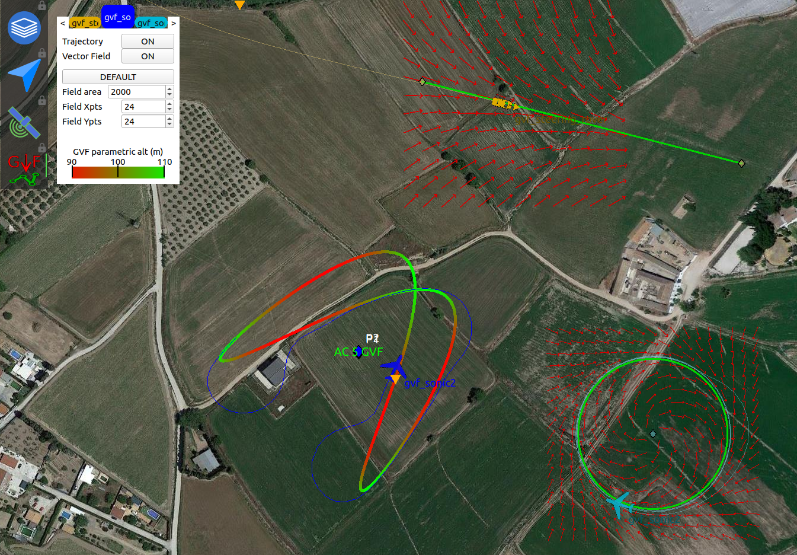
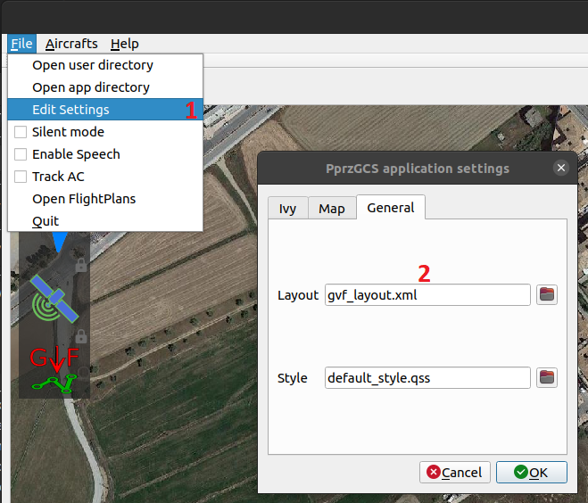
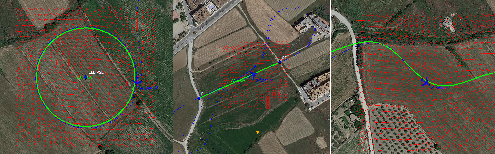
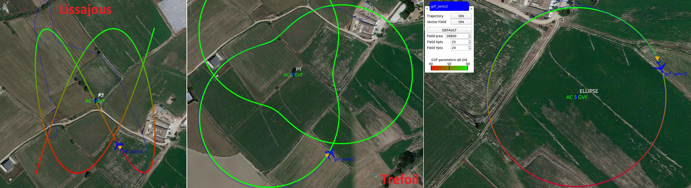

.. user_guide gvf_viewer

================
GVF Viewer
================

GVF Viewer is a GCS widget that allows us to visualise parametric trajectories and vector fields generated by GVF (guiding vector field) guidance algorithm.

How to load GVF Viewer
-----------------------

The GVF Viewer tool is built inside the GCS map widget but will be deactivated until you load it in your layout. In the image below you can see how we load ``gvf_layout.xml``. This layout is a simple example that just includes the GVF Viewer widget in the left column.

.. code-block:: xml

  <!-- PprzGCS/data/gvf_layout.xml -->

  <gcsconf>
    <layout width="1000" height="800">
      <columns>
        <widget name="map2d" size="800">
          <configure>
            <columnLeft>
                <widget name="layers" icon="map_layers_normal.svg"/>
                <widget name="commands" icon="nav.svg"/>
                <widget name="gps_classic_viewer" icon="gps.svg"/>
                <widget name="gvf_viewer" icon="gvf.svg"/> <!-- Load GVF Viewer -->
            </columnLeft>
            <columnRight>
                <widget name="PFD" icon="pfd.svg"/>
                <widget name="settings" icon="settings.svg"/>
                <widget name="plotter" icon="plotter.svg">
                    <configure>
                        <plot name="ground:ENGINE_STATUS:bat" min="9" max="13"/>
                    </configure>
                </widget>
                <widget name="link_status" icon="link_ok.svg"/>
            </columnRight>
          </configure>
        </widget>
        <rows size="200">
            <widget name="strips" container="list" alt="commands"/>
            <widget name="flightplan"/>
        </rows>
      </columns>
    </layout>
    <speech locale="en_GB">
        <message name="ground:FLIGHT_PARAM:agl" text="{AC} altitude, {value} meters AGL" timeout="20" expire="10" priority="1"/>
        <message name="ground:AP_STATUS:ap_mode" text="mode {value}" timeout="0" expire="20" priority="2" onChange="true"/>
        <message name="ground:NAV_STATUS:cur_block" text="block {value}" timeout="0" expire="10" priority="0" onChange="true" postprocessing="block"/>
    </speech>
  </gcsconf>
  

Once we loaded GVF Viewer, we need an aircraft working with GVF. In order to test some features of this tool, the user can load with ``start.py`` the GVF configurations located in ``conf/userconf/GVF`` and compile the simulation target.

How GVF Viewer works
--------------------

The GVF Viewer uses the ``GVF`` and ``GVF_PARAMETRIC`` telemetry messages data to draw both the vector field and the parametric trajectory. This way, once the server recive any of these messages from any AC, the tool will start to draw with the default configuration.

To set up a custom configuration we just have to click on the GVF icon. In the new dialog that instantly appears the user will be able to change some variables of the drawer and visualise the altitude color bar.

GVF trajectories
----------------

Although GVF formally allows to follow every parametric trajectory, at this moment there are just a few examples implemented.

GVF classic
___________

The GVF classic version currently includes the line, 2D ellipse, and sine trajectories.

GVF parametric
______________

In GVF parametric the user will find more complex trajectories such as the trefoil, 3D ellipse, and lissajous.

