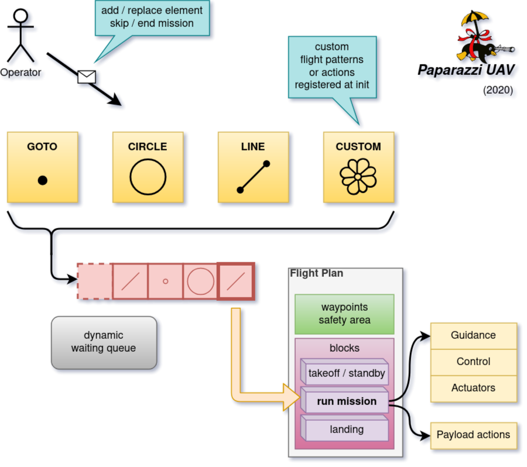

.. user_guide mission_mode

================
Mission mode
================

The Mission interface is based on datalink messages that dynamically
add tasks (basic navigation patterns) to a queue, rather than using a static sequence like the flight plan. 

Loading the mission controller
------------------------------

The mission controller is based on a module, that holds a common part for the message parsing and a specific part
for the navigation (which depend on the firmware). Currently the available modules are:

- ``conf/modules/mission_fw.xml``
- ``conf/modules/mission_rotorcraft.xml``

The interface provides a ``mission_run()`` function that must be called from the classic flight plan.
The mission controller will gives the control back to the flight plan when there is no more tasks to do.
A sample flight plan is provided with takeoff, mission control and landing procedures: ``conf/flight_plans/mission_fw.xml``.

Mission elements
----------------

The elements (or tasks) are basic navigation patterns that are sent to the aircraft and stored in a circular buffer.
For each element, an insertion mode and an index is required. A duration can be defined as well.
The index (1 byte) for each element is left to the user. The report message will send back the array of index.

.. note::
    The index must be uniq in the circular buffer. If an element is sent with an index already existing in the list, it will be ignored.
    
    The index valid range is **[1 ; 255]**. Index 0 is reserved to signal there are no mission elements left.

The insertion modes are:

- **Append**: add the task at the last position of the tasks list.
- **Prepend**: add the task before the current element (the current one remains in the list).
- **ReplaceCurrent**: replace the current mission element.
- **ReplaceAll**: remove all elements in the tasks list and add a new one.

A duration for each element can be specified. The time is a floating point value in seconds.
When setting a **zero or negative** value, the duration parameter is **not** taken into account.
Be aware that some navigation patterns (like segment) will end when reaching the end of the pattern or at
the end of the duration time, but some (like circle) will not end if a positive duration is not set.
It is always possible to go to the next mission element with the ``NEXT_MISSION`` message.

Navigation patterns
-------------------

The navigation patterns are more or less the same than the ones available from the flight plan (except user specific functions).
The vertical control is currently limited to altitude control.

- **GOTO_WP**: go to a specific waypoint

    - **wp_east**: local east position of the waypoint
    - **wp_north**: local north position of the waypoint
    - **wp_alt**: altitude above geoid (MSL) of the waypoint

- **GOTO_LLA**: go to a specific global waypoint

    - **lat**: latitude of the waypoint
    - **lon**: longitude of the waypoint
    - **wp_alt**: altitude above geoid (MSL) of the waypoint

- **CIRCLE**: fly a circle around a waypoint

    - **center_east**: local east position of the center
    - **center_north**: local north position of the center
    - **center_alt**: altitude above geoid (MSL)
    - **radius**: radius of the circle (positive to turn clockwise, negative to turn counter-clockwise)

- **CIRCLE_LLA**: fly a circle around a global waypoint

    - **center_lat**: latitude of the center
    - **center_lon**: longitude of the center
    - **center_alt**: altitude above geoid (MSL)
    - **radius**: radius of the circle (positive to turn clockwise, negative to turn counter-clockwise)

- **SEGMENT**: fly a segment between two waypoints

    - **segment_east_1**: local east position of the start waypoint
    - **segment_north_1**: local north position of the start waypoint
    - **segment_east_2**: local east position of the end waypoint
    - **segment_north_2**: local north position of the end waypoint
    - **segment_alt**: altitude above geoid (MSL)

- **SEGMENT_LLA**: fly a segment between two global waypoints

    - **segment_lat_1**: latitude of the start waypoint
    - **segment_lon_1**: longitude of the start waypoint
    - **segment_lat_2**: latitude of the end waypoint
    - **segment_lon_2**: longitude of the end waypoint
    - **segment_alt**: altitude above geoid (MSL)

- **PATH**: fly a sequence of segments (max 5 waypoints)

    - **point_east_i**: local east position of waypoint 'i'
    - **point_north_i**: local north position of waypoint 'i'
    - **path_alt**: altitude above geoid (MSL)
    - **nb**: number of waypoints in the path (max 5)
    - **note**: the 5 points are always sent, but only the first *nb* are used

- **PATH_LLA**: fly a sequence of segments (max 5 global waypoints)

    - **point_lat_i**: latitude of waypoint 'i'
    - **point_lon_i**: longitude of waypoint 'i'
    - **path_alt**: altitude above geoid (MSL)
    - **nb**: number of waypoints in the path (max 5)
    - **note**: the 5 points are always sent, but only the first *nb* are used

- **CUSTOM**: fly a custom pattern that have been registered by a navigation module (see dedicated section below)

    - **type**: string identifier of the custom (5 char max)
    - **params**: array of float (12 max) to pass pattern parameters

Mission status report
---------------------

The mission controller is periodically sending a report message MISSION_STATUS with the following fields:

- *remaining_time* : time remaining for the current element in seconds (-1. if unlimited time)
- *index_list*: list of the elements pending in the mission controller

    - each value in this list correspond to the index of each element
    - the first element in the list is the current one
    - if the list is empty, a single element with the value zero (0) is sent

Custom patterns
---------------

