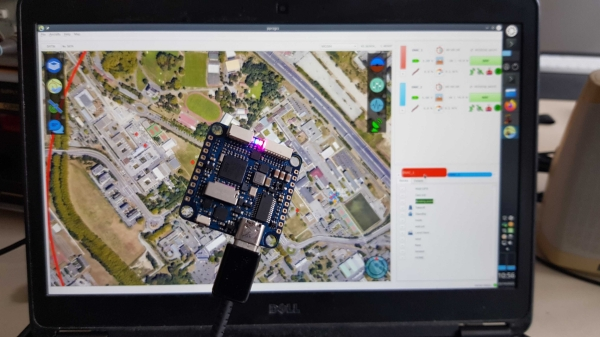

.. user_guide simulation hitl

.. _hitl:

===========================
Hardware in the Loop
===========================

Hardware In The Loop (HITL) simulation is a way to test an embedded system (the real hardware and software) by simulating its environment, 
ie. sensor inputs, and comparing its output, ie. actuator outputs, to expected output values. 
It is the closest to an actual flight without actually flying.

Principle
-----------

While the SITL simulation executes the airborne code on the ground host, HITL is a way to run the autopilot code on the actual hardware in an 
environment where sensors and actuators are simulated. The difference is shown in diagrams below: SITL generates the physical behavior of 
the airplane from the Flight DynaMics (FDM) Block, then feeds the generated values into virtual sensors, the sensor inputs are processed in 
the autopilot and the autopilot control ouputs are captured and fed back into the FDM. HITL does the same, except it communicates with the autopilot over serial ports.

In HITL, two separate processes are involved:

- The real autopilot code on the control board with its own IO (for example battery voltage, etc);
- A flight model combined with a model of the actuators and the sensors.

Commands computed by the autopilot are sent to the flight model which sends back simulated values of the sensors output.

.. figure:: images/600px-Hitl.png

  Hardware-in-the-loop (HITL) autopilot testing block diagram

.. figure:: images/550px-Sitl.png

  Software-in-the-loop (SITL) autopilot testing block diagram

Limitations
-----------------

For practical reasons (it is very difficult to simulate SPI/I2C devices such as accelerometer, gyroscope etc.), 
Paparazzi HITL simulates sensors and sends them through a dedicated link (independent of the telemetry link). It is thus recommanded to use
the *usb_serial* driver or if not available a serial link with high baudrate.

Another consideration is the bandwidth of the system - the sensor data and the actuator values have to be send/received at ``PERIODIC_FREQUENCY`` (between 40-512 Hz) for HITL to work correctly. Not all communication links and frequencies are feasible without introducing latency or bandwidth saturation.

When to use SITL and when HITL?
------------------------------------

The advantage of SITL is that it is easy to deploy and test, because no additional hardware is needed. This means that simulation is very self-contained. 
Ideally use for testing flight plans, or initial tuning of airframes. SITL can run faster than real time.

HITL is the simulation closest to real flight, because both the hardware and the code are identical to the set being used in real flight 
the autopilot is really flying with artificial sensor data. HITL is used to test the flight hardware, once the flight plan and initial tuning 
has been configured. Usually HITL is the last thing to run before going flying.

Prerequisites
--------------------

.. warning::
  some recommendations may not apply, in particular if real USB is used instead of UART or UART-USB bridge

HITL currently (Ubuntu 16.04) needs the following two steps to run correctly:

- set rtpriority for the uart threads detailes `here <https://stackoverflow.com/questions/8111302/why-does-pthread-setschedparam-produce-eperm-on-opensuse-11-4>`_ 
  by adding these two lines to your ``/etc/security/limits.conf`` file:

.. code-block:: php

  domain       type    item     value
  $USER       soft    rtprio   100
  $USER       hard    rtprio   100
  where $USER is your username

- install pyserial package (needed for SBUS Fakerator), typically with ``sudo install pyserial``.

Configuration
------------------------

.. warning::
  HITL support as changed in version 6.3, older procedure (especially described in the `wiki <https://wiki.paparazziuav.org/wiki/HITL>`_, no longer applies

HITL can currently run on any that has:

- Serial port (at high speed) or USB for sending commands and receiving sensor data
- Other serial/io for regular telemetry, RC input etc.

Note that HITL is timing sensitive (at 512Hz you need to receive, process, and send data every ~2ms).

Examples are provided based on the Matek H7 Slim: ``conf/airframes/examples/matek_h7_fixedwing_hitl.xml`` and ``conf/airframes/examples/matek_h7_rotorcraft_hitl.xml``

The airframe needs to contain: 

* ``sensors_hitl`` module in main firmware section
* ``actuators_hitl`` module in main firmware section
* a specific HITL firmware section ``<firmware name="generic_hitl">...</firmware>`` that contains an ``hitl`` target with the selected FDM and the module ``nps_hitl_sensors``

.. warning::
  an ariframe file configured for HITL simulation can usually also be used with normal SITL simulation, but is not compatible with normal ``ap`` target as the sensors and actuators drivers are replaced by simulation modules

Modules in main firmware section
^^^^^^^^^^^^^^^^^^^^^^^^^^^^^^^^

Here is an example of configuration for fixedwing or rotorcraft using an USB link (alternate debug link, primary `usb_serial` is used for telemetry):

.. code-block:: xml

    <configure name="HITL_PORT" value="usb_serial_debug"/>
    <configure name="USE_HARD_FAULT_RECOVERY" value="FALSE"/>
    <module name="sensors" type="hitl">
      <define name="USE_BATTERY_MONITOR"/>
    </module>
    <module name="actuators" type="hitl"/>

It is preferable to disable the hard fault recovery mode for HITL.

Since the sensors data received are IMU, GPS and barometer data, any internal INS/AHRS filter compatible with your airframe should work.

HITL Target
^^^^^^^^^^^^^^^

Add an extra firmware and an ``hitl`` target in your airfame config file:

.. code-block:: xml

  <firmware name="generic_hitl">
    <target name="hitl" board="pc">
      <module name="fdm" type="jsbsim"/>
      <module name="nps" type="hitl_sensors">
        <define name="AP_DEV" value="/dev/ttyACM1" type="string"/>
      </module>
    </target>
  </firmware>

We have to specify the FDM for the HITL simulation. We recommend :ref:`jsbsim`, but any FDM that :ref:`nps` supports should work (because NPS is the backend for HITL).

``AP_DEV`` correcponds to the serial link which is used to have a direct communication with the autopilot and exchange commands and data. It as to match the one selected on the airborne side (``usb_serial_debug`` in example above).

Running
-------------------

Once you have your setup completed:

- Clean, compile and upload the `hitl` target. This target will build at the same time the `ap` target and the ground part for simulation. It is also possible to build separately the AP and then HITL but it is not recommended.
- Choose ``HITL demo`` session and Execute

.. note::
  
  If you want to use your own session, you have to pass ``-t hitl`` flag into ``sw/simulator/pprzsim-launch`` to start in HITL mode. 
  Have a look at the ``HITL USB-serual@57600`` session for example, or add this to your own:

Similar steps work for rotorcraft.

FlightGear
^^^^^^^^^^^^^

We strongly recommend running HITL with :ref:`flightgear` for visualization. The steps are the same as when running :ref:`nps` targets, please refer for documentation there.

Issues
--------------

If you find a problem that is not mentioned here, please contact out gitter channel or file an issue on github.

Known issues:

setschedparam failed error
^^^^^^^^^^^^^^^^^^^^^^^^^^^^^^

If you get "setschedparam failed!" error when running NPS/HITL, you have to change limits.conf - see https://stackoverflow.com/q/10704983/9237888

In short, edit your /etc/security/limits.conf file and add these lines at the bottom:

.. code-block::

  domain       type    item     value
  YOUR_USERNAME       soft    rtprio   100
  YOUR_USERNAME       hard    rtprio   100

Then I believe you have to restart your computer in order for limits to refresh.

Happy flying!

