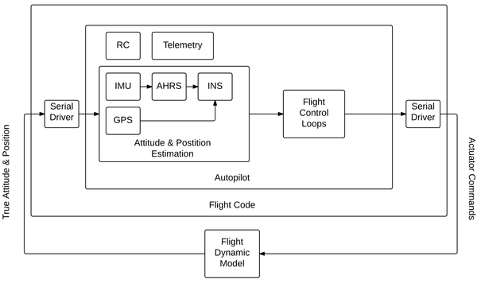
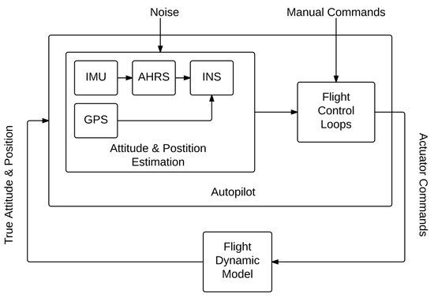
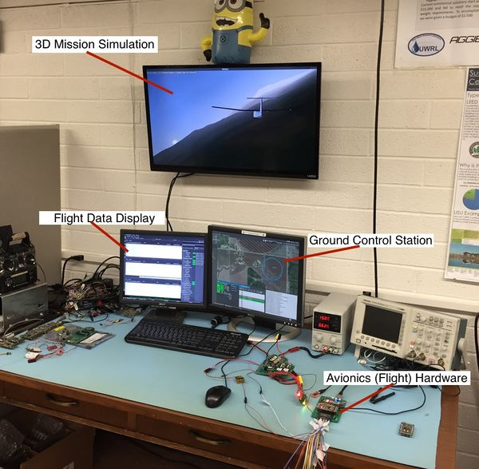
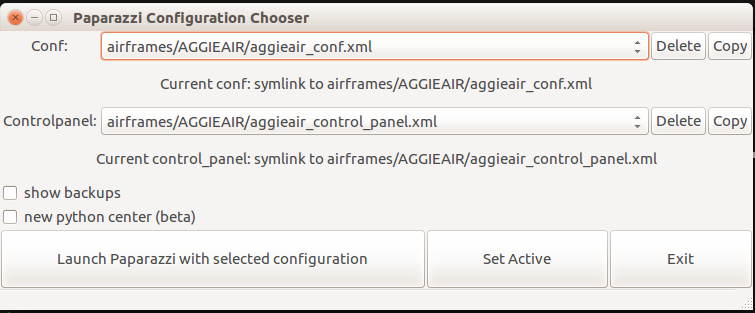
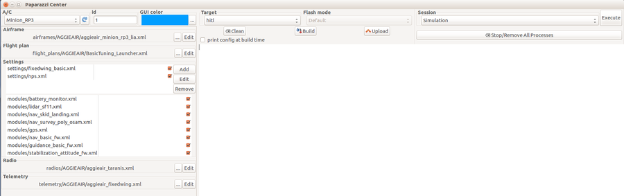
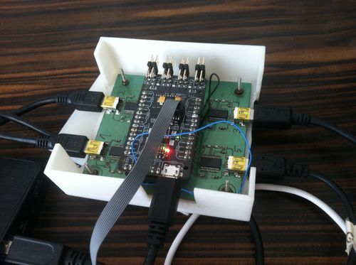
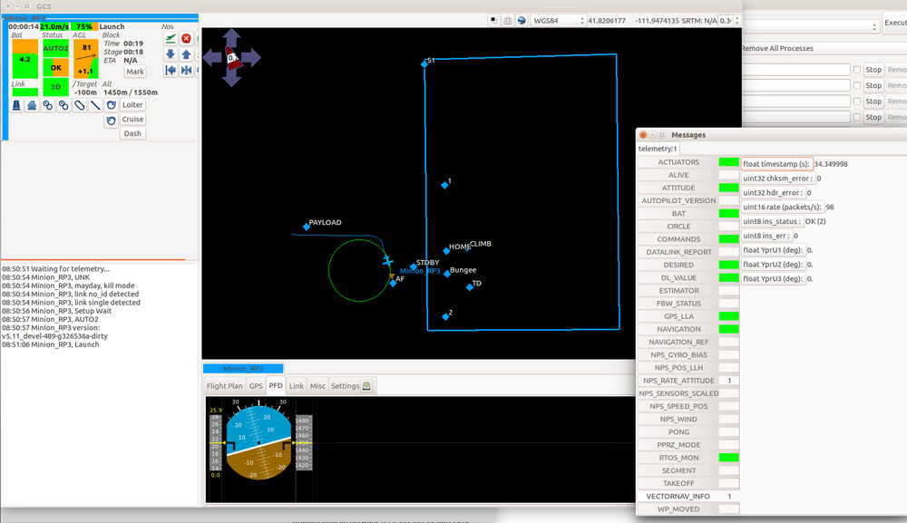
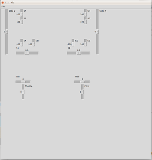
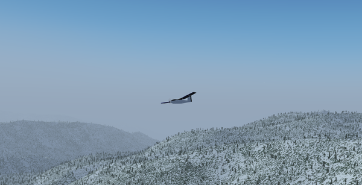

.. user_guide simulation hitl

.. _hitl:

===========================
Hardware in the Loop
===========================

Hardware In The Loop (HITL) simulation is a way to test an embedded system (the real hardware and software) by simulating its environment, 
ie. sensor inputs, and comparing its output, ie. actuator outputs, to expected output values. 
It is the closest to an actual flight without actually flying. Using Paparazzi's Software In The Loop (SITL) and HITL for validation of a 
flight dynamics of a fixed wing UAV is in detail described in a paper "Software-and hardware-in-the-loop verification of flight dynamics 
model and flight control simulationof a fixed-wing unmanned aerial vehicle" by Cal Coopmans and Michal Podhradsky. Refer to the paper for more details.

Principle
-----------

While the SITL simulation executes the airborne code on the ground host, HITL is a way to run the autopilot code on the actual hardware in an 
environment where sensors and actuators are simulated. The difference is shown in diagrams below: SITL generates the physical behavior of 
the airplane from the Flight DynaMics (FDM) Block, then feeds the generated values into virtual sensors, the sensor inputs are processed in 
the autopilot and the autopilot control ouputs are captured and fed back into the FDM. HITL does the same, except it communicates with the autopilot over serial ports.

In HITL, two separate processes are involved:

- The real autopilot code on the control board with its own IO (for example battery voltage, etc);
- A flight model combined with a model of the actuators and the sensors.

Commands computed by the autopilot are sent to the flight model which sends back simulated values of the sensors output.

  Hardware-in-the-loop (HITL) autopilot testing block diagram

  Software-in-the-loop (SITL) autopilot testing block diagram

Limitations
-----------------

.. warning::

  HITL currently works only with Pprzlink 1.0, which is not supported anymore. The code might not work as desired yet.

For practical reasons (it is very difficult to simulate SPI/I2C devices such as accelerometer, gyroscope etc.), 
Paparazzi HITL simulates only sensors that connect to the autopilot via serial port (for example GPS unit, or an external AHRS/INS). 
Currently implemented is Vectornav VN-200 in INS mode, but other sensors and modes can be added (i.e. VN-200 as IMU, Xsens INS etc.). 
Because the benefit of HITL is to test the autopilot code that is identical to the actual flight code, no other means of transporting 
sensor data to the autopilot are currently supported (such as sending them through uplink).

Another consideration is the bandwidth of the system - the sensor data and the actuator values have to be send/received at ``PERIODIC_FREQUENCY`` (between 40-512 Hz) for HITL to work correctly.

When to use SITL and when HITL?
------------------------------------

The advantage of SITL is that it is easy to deploy and test, because no additional hardware is needed. This means that simulation is very self-contained. 
Ideally use for testing flight plans, or initial tuning of airframes. SITL can run faster than real time.

HITL is the simulation closest to real flight, because both the hardware and the code are identical to the set being used in real flight 
the autopilot is really flying with artificial sensor data. HITL is used to test the flight hardware, once the flight plan and initial tuning 
has been configured. Usually HITL is the last thing to run before going flying.

Prerequisites
--------------------

HITL currently (Ubuntu 16.04) needs the following two steps to run correctly:

- set rtpriority for the uart threads detailes `here <https://stackoverflow.com/questions/8111302/why-does-pthread-setschedparam-produce-eperm-on-opensuse-11-4>`_ 
  by adding these two lines to your ``/etc/security/limits.conf`` file:

.. code-block:: php

  domain       type    item     value
  $USER       soft    rtprio   100
  $USER       hard    rtprio   100
  where $USER is your username

- install pyserial package (needed for SBUS Fakerator), typically with ``sudo install pyserial``.

Configuration
------------------------

HITL can currently run on any that has:

- Serial port for Vectornav INS input (provides position and orientation data, including GPS coordinates)
- Serial port for additional high-speed telemetry output (so not your regular 57600 telemetry)
- Other serial/io for regular telemetry, RC input etc.

If you have high-speed telemetry (like over WiFi) it should be possible to use only one telemetry link and demux the messages on GCS, 
but it is not currently supported. Note that HITL is timing sensitive (at 512Hz you need to receive, process, and send data every ~2ms).

HITL has been tested on:

- Lisa M/MX (exampes for `fixedwing <https://github.com/paparazzi/paparazzi/blob/master/conf/airframes/AGGIEAIR/aggieair_minion_rp3_lia.xml>`_ and 
  `rotorcraft <https://github.com/paparazzi/paparazzi/blob/master/conf/airframes/AGGIEAIR/aggieair_ark_hexa_1-8.xml>`_)
  
- Umarim v 2.0 (example for `fixedwing with Unarim <https://github.com/paparazzi/paparazzi/blob/master/conf/airframes/AGGIEAIR/El_Captain.xml>`_)

We recommend a dedicated computer for HITL, with enough CPU power and memory, and a nice graphics card for :ref:`flightgear` visualisation 
(see the test station in the picture). HITL can run on a regular laptop too (tested on both Lenovo Thinkpad and Toughbooks).

  Hardware-in-the-loop (HITL) test station in simulated flight

There are a few example airframes to choose from. Let's start with a fixed wing airplane and walk you through step by step. Get a fresh copy of the latest paparazzi and do:

.. code-block:: php

  # in prrz root dir
  ./start.py

and choose AggieAir's ``conf`` and ``control panel``:

  Select AggieAir's conf and control panel and then Launch

Choose **Minion_RP3** airframe:

  Minion RP3 airfame

and click on **Edit**. The airframe file is on github: https://github.com/paparazzi/paparazzi/blob/master/conf/airframes/AGGIEAIR/aggieair_minion_rp3_lia.xml For HITL to work, there have to be 4 things:

- `extra_dl <https://github.com/paparazzi/paparazzi/blob/master/conf/modules/extra_dl.xml>`_ telemetry module
- specified ``COMMANDS`` (Fixedwing) or ``ACTUATORS`` (rotorcrafts) Extra telemetry message in the telemetry config file (an example `with AggieAir here <https://github.com/paparazzi/paparazzi/blob/master/conf/telemetry/AGGIEAIR/aggieair_fixedwing.xml#L108>`_)
- HITL target
- Airframe configured to use external INS

Extra_DL Module
^^^^^^^^^^^^^^^^^^^^^^

This is the additiona high speed telemetry link that sends the actuators data back to the FDM.

.. code-block:: php

  # in your airframe config file
      <module name="extra_dl">
        <!-- in order to use uart1 without chibios we need to remap the peripheral-->
        <define name="REMAP_UART1" value="TRUE"/>
        <configure name="EXTRA_DL_PORT" value="UART1"/>
        <configure name="EXTRA_DL_BAUD" value="B921600"/>
      </module>

If you have `Umarim <https://wiki.paparazziuav.org/wiki/Umarim_Lite_v2>`_ board or similar, you can also use a usb serial port:

.. code-block:: php

  # in your airframe config file
      <module name="extra_dl">
        <configure name="EXTRA_DL_PORT" value="usb_serial"/>
        <configure name="EXTRA_DL_BAUD" value="B921600"/>
      </module>

Telemetry config file
^^^^^^^^^^^^^^^^^^^^^^^^

Just add this section to your telemetry config file:

.. code-block:: php

  # in your telemetry config file
    <process name="Extra">
      <mode name="default">
        <message name="COMMANDS"            period="0.01"/>
      </mode>
    </process>

The period has to be matching your ``PERIODIC_FREQUENCY`` - best if you explicitly define all the frequencies to avoid ambiguity:

.. code-block::

  # in your airfame config file
      <!-- NOTE: if you want to use extra_dl module for HITL
      you have to set TELEMETRY_FREQUENCY to CONTROL_FREQUENCY -->
      <configure name="PERIODIC_FREQUENCY" value="100"/>
      <define name="CONTROL_FREQUENCY" value="100"/>
      <configure name="TELEMETRY_FREQUENCY" value="100"/>
      <define name="SERVO_HZ" value="100"/>

NOTE: the ``TELEMETRY_FREQUENCY`` has to match your ``PERIODIC_FREQUENCY``

HITL Target
^^^^^^^^^^^^^^^

Add the target in your airfame config file:

.. code-block:: php

  # in your airfame config file
      <target name="hitl" board="pc">
        <module name="fdm" type="jsbsim"/>
        <configure name="INS_DEV" value="/dev/ttyUSB1"/>
        <configure name="INS_BAUD" value="B921600"/>
        <configure name="AP_DEV" value="/dev/ttyUSB2"/>
        <configure name="AP_BAUD" value="B921600"/>
      </target>

What does it mean? First, we have to specify the FDM for the HITL simulation. We recommend :ref:`jsbsim`, but any FDM that :ref:`nps` supports should work (because NPS is the backend for HITL).

Then we have to specify the serial ports to talk to the autopilot. ``INS_DEV`` is the port your external INS (such as Vectornav) is using. 
AP_DEV is the port for the extra telemetry. Make sure your baud rates are matching too.

Note that you can either specify the devices in ``/dev/ttyUSB*`` format, which makes it universal across different USB-to-serial converters, 
but you have to remember to plug in the ports in the right order (since they enumerate sequentially).

The other option is to specify the ``/dev/serial/by-id/usb-FTDI_*****`` format, in which case it doesn't matter in which order you plug the 
devices in, but you can use it only for a particular FTDI converter.

It might be handy to use a simple Lia breakout board for connecting all the serial 
ports - `the breakout board files are available here <https://github.com/paparazzi/paparazzi-hardware/tree/master/controller/lia/breakout_board>`_.

  Lia breakout board

Airframe Configuration for External INS
^^^^^^^^^^^^^^^^^^^^^^^^^^^^^^^^^^^^^^^^^^^^^

Indeed, HITL will work only if your aiframe is configured to use external INS of some sort. In our example, we specify using Vectornav:

.. code-block::

  # in your airfame config file
      <module name="ins"       type="vectornav">
        <configure name="VN_PORT" value="UART2"/>
        <configure name="VN_BAUD" value="B921600"/>
      </module>

See the `Minion_RP3 airframe config <https://github.com/paparazzi/paparazzi/blob/master/conf/airframes/AGGIEAIR/aggieair_minion_rp3_lia.xml>`_ for more details.

Running
-------------------

Once you have your setup completed:

- Clean, compile and upload the AP target (HINT: use keyboard shortcuts **Alt+C** to **Clean**, **Alt+B** to **Build** and **Alt+U** to **Upload**)
- Clean and build HITL target
- Choose ``HITL USB-serial@57600`` session and Execute

.. note::
  
  If you want to use your own session, you have to pass ``-t hitl`` flag into ``sw/simulator/pprzsim-launch`` to start in HITL mode. 
  Have a look at the ``HITL USB-serual@57600`` session for example, or add this to your own:

Messages will pop up and you can verify that you are getting data by looking at the ``VECTORNAV_INFO`` message:

.. figure:: images/300px-Hitl_messages.png

  VECTORNAV_INFO message

And once you take-off you will see something like this:

  HITL Flight with fixedwing airplane

Similar steps work for rotorcraft.

SBUS Fakerator
^^^^^^^^^^^^^^^^^^^^^

A simple tool simulating SBUS radio inputs is available. It is useful if you don't have a radio around, and want to test flight in manual mode. 
It has to be used with a `Sbus_fakerator radio config file <https://github.com/paparazzi/paparazzi/blob/master/conf/radios/AGGIEAIR/aggieair_sbus_fakerator.xml>`_ and it requires an additional serial port (for example ``/dev/ttyUSB3``). 
It can be launched as a tool from the Paparazzi center.

Source code is available at: https://github.com/paparazzi/paparazzi/tree/master/sw/tools/sbus_fakerator

  SBUS fakerator tool

FlightGear
^^^^^^^^^^^^^

We strongly recommend running HITL with :ref:`flightgear` for visualization. The steps are the same as when running :ref:`nps` targets, please refer for documentation there.

Issues
--------------

If you find a problem that is not mentioned here, please contact out gitter channel or file an issue on github.

Known issues:

setschedparam failed error
^^^^^^^^^^^^^^^^^^^^^^^^^^^^^^

If you get "setschedparam failed!" error when running NPS/HITL, you have to change limits.conf - see https://stackoverflow.com/q/10704983/9237888

In short, edit your /etc/security/limits.conf file and add these lines at the bottom:

.. code-block::

  domain       type    item     value
  YOUR_USERNAME       soft    rtprio   100
  YOUR_USERNAME       hard    rtprio   100

Then I believe you have to restart your computer in order for limits to refresh.

Happy flying!

