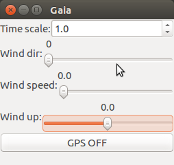

.. user_guide simulation sim

.. _sim:

===========================
SIM
===========================

This describes the basic fixedwing sim, for rotorcraft or advanced fixedwing simulation, see **NPS**.

Configure and Build
^^^^^^^^^^^^^^^^^^^^^^^^^^

From the :ref:`paparazzicenter` select the Microjet aircraft (from the A/C combo box) which is configured with the ``basic.xml`` flight plan. 
From the **Target** combo box, select **sim** and click the **Build** button to compile the airborne code to be run on your Linux box. 
From the **Session** combo box, select **Simulation** entry and click **Execute** to start the simulation. It will start three processes which are listed in the window below:

- **Microjet** is the interface of a simulator program. It runs the same code as the one for the autopilot processor plus a rudimentary flight dynamic model. 
  It allows you to test the interactions with the UAV and the flight plan execution.
- **GCS** (:ref:`gcs`) is the main window. It displays the track of the aircraft, as well as information about the execution of its flight plans. 
  This program provide menus for the datalink functions and is able to edit a flight plan.
- **Server** is a hidden process which won't be described here (see the architecture of the system).

Start the Simulation
^^^^^^^^^^^^^^^^^^^^^^^^^^

The aircraft has automatically been booted, as if the autopilot board had been powered. Its position and its flight parameters are displayed in the GCS window. 
If you omit the ``-boot`` option of the sim the aircraft is not automatically booted and you can first place the aircraft where you want it to start from and then boot.

If the ``--norc`` option is omitted, a window for a virtual remote control (including on/off switch and a mode-switch) is started, see: Virtual Joystick

In the **GCS** the map widget is able to use many map formats and display them according to many projections. 
To make things simple, we start by using images from Google. From the toolbar in the top right corner of the GCS, 
click the **Google Earth** icon (Google maps fill). The program attempts to download the required satellite images from the Google servers. 
If it succeeds, you should now see the nice countryside of Muret (a city close to Toulouse, France). Navigation and other features of the map are described on the GCS page.

The lower part of the GCS displays the flight plan in a tree view. You see that the current flight plan is composed of several blocks:

- **wait GPS** and **geo init** which are instructions to run this flight plan anywhere in the world, by translating the waypoints around the 
  current location of aircraft as soon as it is reported by the GPS.
- **Holding point** (it should be the current active block) which instructs the autopilot to wait for launch.
- **Takeoff** which will instruct the aircraft to climb full throttle to a security altitude
- **Standby** which is a simple circle around the ``STDBY`` waypoint.

Switch to the **Takeoff** block by a double click on the line or using the corresponding button (an icon figuring an airway) on the left side of the strip.

Fly 
^^^^^^^^^^^^

In the Simulator (Microjet window), press the Launch button to simulate a hand launch or click the launch button in the GCS 
(the green aircraft icon). The autopilot detects the launch by monitoring the groundspeed. The flight time (in the aircraft label on the GCS) then starts to count.

Position of the aircraft is displayed on the map: the aircraft goes to the ``CLIMB`` waypoint (to the north-west) and then around the ``STDBY`` waypoint. 
Current block also changes accordingly in the flight plan display.

The orange triangle (the carrot) on the map is the point that the aircraft is navigating toward.

Line 
^^^^^^^^

Jump to this block with double-click on the Line 1-2 line in the flight plan or using the corresponding button in the strip 
(figuring a blue line between two white points). The aircraft will try to follow a line joining the waypoints 1 and 2, doing nice U-turns at both ends.

Move waypoints
~~~~~~~~~~~~~~~~~~~

While the aircraft is flying (or here while the simulator is integrating differential equations), you can move the waypoints on the 
GCS interface by clicking and dragging (with the left button). When the mouse button is released, a popup window allows you to change the 
altitude of the waypoint. After validation, the waypoint changes are sent to the autopilot and the followed track is changed accordingly.

Coming back around
~~~~~~~~~~~~~~~~~~~~

Select the Standby block (the home blue icon) to instruct the aircraft to fly around the ``STDBY`` waypoint.

Fly too far 
^^^^^^^^^^^^^^^^^^

If you unzoom the map (using the PageDown key or he mouse wheel), you will see a large circle around the waypoints. 
This circle show the allowed flying zone that the autopilot must not leave or it will enter an emergency navigation 
mode and circles the ``HOME`` waypoint until the further direction is received.

Move the waypoint 2 out of this circle (close to the circle in the north-east corner) and switch back to the 'Line 1-2 **block to force the plane to get out of this safety zone**.

The aircraft flies to the 2 waypoint, cross the protection envelope and switches to home mode: the AP mode in the aircraft strip switches from ``AUTO2`` to ``HOME``.

To get out of this mode and switch back to the default ``AUTO2``, click on the AUTO2 button in the aircraft strip. 
The aircraft then flies again towards too far and again switches to ``HOME`` mode.

Change the environment
^^^^^^^^^^^^^^^^^^^^^^^^^^

Launch the **Environment Simulator** from the Tools' menu in the Paparazzi Center.

This interface, also known as Gaia, allows the user to change:

- **The time-scale**: This make the simulation of the flight speed up time, good if you have a extensive flightplan and you do not want to wait the real 
  time it would take to fly the aircraft in a real life flight. It is best not use a timescale higher than 2x for a first tryout.
- **The Wind speed**: Set the wind speed while simulating. Try to set it to e.g. 5m/s and observe the trajectory and the speed evolution 
  in the aircraft strip and in the PFD page of the notebook
- **The Wind direction**: Set the direction the wind come from. For fun try to take of with strong wind from the side.
- **Wind up**: Simulates updraft (e.g. by thermals) or downdraft wind (beside thunderstorms or in mountains), which could e.g. shift the 
  UAS higher than permitted, which can be counteracted by exceptions in the flightplan.
- **A GPS failure**: Simulate GPS loss on the aircraft (``GPS OFF``) and observe the resulting mode (``NO_GPS``) and trajectory. 
  In this mode, the autopilot can for example use a the failsafe roll, pitch and throttle settings defined in the airframe file. 
  Note that in a real flight, an aircraft without GPS won't be able to send it's position ... The simulation is cheating here! 
  It must, otherwise not possible to show the path in the simulator, of course.

Environment Simulator, Gaia can also be started with initial values set by command line option.

.. code-block:: php

  -b Bus Default is 127.255.255.255:2010
  -t Set time scale (default: 1.0)
  -w Set wind speed (0-30m/s)
  -d Set wind direction 0-359 deg
  -g Turn off GPS
  -help  Display this list of options
  --help  Display this list of options

If you are in the test field and forgot the parameters, just use the "help"

.. code-block:: php

  ./gaia --help

This make testing more convenient since on can save a session with this parameters and on restart immediately have the same settings again.

Example
~~~~~~~~~~~~

Starting gaia with the following parameters on the command line:

.. code-block:: php

  sw/simulator/gaia -t 3 -d 340 -w 11

This sets a 3x speedup of the time with wind coming from 340 degrees with a windspeed of 11m/s.

Other Navigation Patterns
^^^^^^^^^^^^^^^^^^^^^^^^^^^^^

Using the buttons in the strip, you can play with other navigation patterns: figure of eights, oval, 
survey of a rectangle (with a north-south sweeping), Circle around here (which sets a waypoint to the current 
location of the plane and flies a circle around).

Landing
^^^^^^^^^^^^^^^

To automatically land the aircraft:

- Set the ``TD`` (Touch Down) waypoint where you want to land. Be sure that the waypoint is on the ground (185m in Muret)
- Set the ``AF`` (Approach Fix) waypoint where you want to start the final descent (the glide). If you have set some wind with Gaia, 
  you probably want to fly ``AF-TD`` upwind (an estimation of the wind experienced by the aircraft is displayed in the left-upper corner of the map).
- Switch to the Land right or the Land left block (icons in the strip) according to the direction of the last turn 
  you want to do (for example, if ``AF`` is on the east side of TD and you want to manoeuver from the north, choose a Land right)