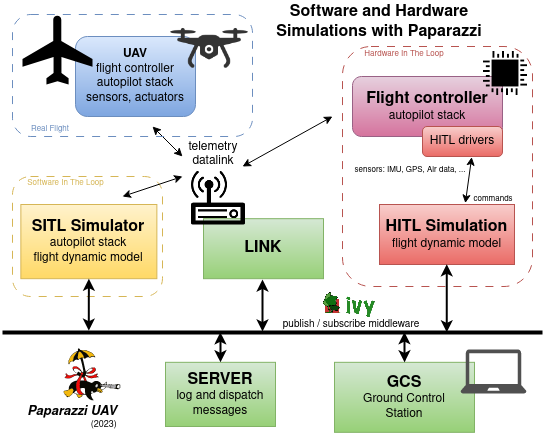

.. user_guide simulation_main

===========================
Simulation
===========================

  Architecture for software or hardware in the loop simulation

A FDM is a set of mathematical equations used to calculate the physical forces acting on a simulated aircraft, such as thrust, lift, and drag.
Paparazzi currently has two different simulator targets with different degrees of realism and intended purpose:

* **sim**: The basic fixedwing simulator without IMU simulation or any sensor models (noise, bias, etc) and mainly intended to validate your :ref:`flightplans` logic.
* **nps**: NPS is a more advanced rotorcraft and fixedwing simulator with sensor models and commonly uses JSBSim as FDM (Flight Dynamic Model). Other FDM's can be integrated easily. At the moment JSBSIM, CRRCSIM, GAZEBO and PyBullet are supported as FDM backend. It is also possible to implement ad-hoc simulation code, based on Matlab/Simulink generated code for instance.
    * **JSBSim**: a flight dynamic library used by default by various simulation sofware including Flight Gear.
    * **gazebo**: Gazebo can be used as flight dynamic engine, but its main interest is to generate virtual sensor readings (cameras, lidars, ...) from a 3D realistic environment.
      Take a look on that page to see if it offers what you are looking for.
    * **PyBullet**: Bullet is a physics simulation engine (simular to gazebo) that allows to easily express the different forces applied to the drones in a high level language thanks to the bindings with Python.
* **hitl**: Hardware in the Loop simulation can be used to run the autopilot on a real flight controller while the flight dynamic model is runing on the host computer.

.. toctree::
    :maxdepth: 1

    simulation/sim
    simulation/nps
    simulation/gazebo
    simulation/hitl
